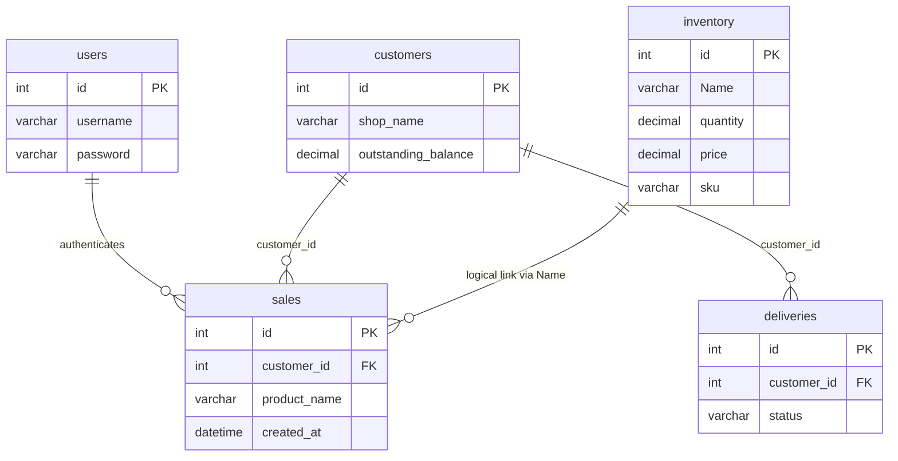

# ThumbsUpApp — Database Schema

**Database name:** `railway`  
**Engine:** MySQL 9.x (InnoDB)  
**Charset:** `utf8mb4` / `utf8mb4_unicode_ci`  
**Source of truth:** `migrations/001-recovery-schema.sql` + `server.js` queries

---

## 1. Entity relationship diagram



> `sales.product_name` is denormalized text, not a foreign key to `inventory.id`. Stock updates match ``inventory.Name``.

---

## 2. Table dependency order (CREATE)

1. `inventory`
2. `customers`
3. `sales` (FK → `customers`)
4. `deliveries` (FK → `customers`)

`users` exists independently (login).

---

## 3. Table definitions

### 3.1 `users` (pre-existing)

| Column | Type | Null | Key | Notes |
|--------|------|------|-----|-------|
| `id` | INT | NO | PRI, AI | |
| `username` | VARCHAR(100) | YES | | Login identifier |
| `password` | VARCHAR(100) | YES | | Plaintext in current app |

**Used by:** `POST /login`

---

### 3.2 `inventory`

| Column | Type | Null | Default | Notes |
|--------|------|------|---------|-------|
| `id` | INT | NO | AI | Primary key |
| `Name` | VARCHAR(255) | YES | | **Capital N** — matches API |
| `quantity` | DECIMAL(12,2) | YES | 0.00 | Cases in stock |
| `price` | DECIMAL(12,2) | YES | 0.00 | Price per case |
| `sku` | VARCHAR(100) | YES | | Searchable |
| `category` | VARCHAR(100) | YES | | |
| `size` | VARCHAR(50) | YES | | Pack label |
| `bpc` | INT UNSIGNED | YES | 24 | Bottles per case |
| `reorder` | DECIMAL(12,2) | YES | 10.00 | Low-stock threshold |

**Indexes:**

- `PRIMARY KEY (id)`
- `idx_inventory_sku (sku)`
- `idx_inventory_name (Name)`

**Used by:** `/products`, `/products/search`, `/products/stats`, `/inventory`, stock decrement in `POST /sales`

---

### 3.3 `customers`

| Column | Type | Null | Default | Notes |
|--------|------|------|---------|-------|
| `id` | INT | NO | AI | Primary key |
| `shop_name` | VARCHAR(255) | NO | | Required on create |
| `owner_name` | VARCHAR(255) | YES | | |
| `phone` | VARCHAR(30) | YES | | |
| `email` | VARCHAR(255) | YES | | |
| `address` | TEXT | YES | | |
| `area` | VARCHAR(100) | YES | | Zone |
| `credit_limit` | DECIMAL(12,2) | NO | 0.00 | |
| `opening_balance` | DECIMAL(12,2) | NO | 0.00 | Not auto-synced to outstanding |
| `outstanding_balance` | DECIMAL(12,2) | NO | 0.00 | Updated by sales/payments |

**Indexes:**

- `PRIMARY KEY (id)`
- `idx_customers_shop_name (shop_name)`
- `idx_customers_area (area)`

**Used by:** `/customers`, `/customers/:id/pay`, joins in sales/deliveries/dashboard

---

### 3.4 `sales`

| Column | Type | Null | Default | Notes |
|--------|------|------|---------|-------|
| `id` | INT | NO | AI | Primary key |
| `customer_id` | INT | NO | | FK → `customers.id` |
| `product_name` | VARCHAR(255) | YES | | Denormalized label |
| `quantity` | INT | YES | 0 | Cases sold |
| `price_per_case` | DECIMAL(12,2) | YES | 0.00 | |
| `total_amount` | DECIMAL(12,2) | YES | 0.00 | Bill total |
| `amount_paid` | DECIMAL(12,2) | YES | 0.00 | |
| `payment_mode` | VARCHAR(50) | YES | | Cash, UPI, etc. |
| `notes` | TEXT | YES | | |
| `created_at` | DATETIME | NO | CURRENT_TIMESTAMP | Dashboard date filters |

**Indexes:**

- `PRIMARY KEY (id)`
- `idx_sales_customer_id (customer_id)`
- `idx_sales_created_at (created_at)`

**Foreign keys:**

```sql
CONSTRAINT fk_sales_customer
  FOREIGN KEY (customer_id) REFERENCES customers(id)
  ON DELETE RESTRICT ON UPDATE CASCADE
```

**Used by:** `/sales`, `/dashboard/*`

---

### 3.5 `deliveries`

| Column | Type | Null | Default | Notes |
|--------|------|------|---------|-------|
| `id` | INT | NO | AI | Primary key |
| `customer_id` | INT | NO | | FK → `customers.id` |
| `product_name` | VARCHAR(255) | YES | | |
| `quantity` | INT | YES | 0 | |
| `delivery_date` | DATE | YES | | |
| `driver_name` | VARCHAR(100) | YES | | |
| `vehicle_no` | VARCHAR(30) | YES | | |
| `status` | VARCHAR(50) | NO | `'Pending'` | Pending, In Transit, Delivered, Failed |
| `notes` | TEXT | YES | | |

**Indexes:**

- `PRIMARY KEY (id)`
- `idx_deliveries_customer_id (customer_id)`
- `idx_deliveries_status (status)`
- `idx_deliveries_delivery_date (delivery_date)`

**Foreign keys:**

```sql
CONSTRAINT fk_deliveries_customer
  FOREIGN KEY (customer_id) REFERENCES customers(id)
  ON DELETE RESTRICT ON UPDATE CASCADE
```

**Used by:** `/deliveries`

---

## 4. Full DDL (reference)

Canonical script: **`migrations/001-recovery-schema.sql`**

```sql
-- See file for complete CREATE TABLE IF NOT EXISTS statements
-- Steps 1-4: inventory, customers, sales, deliveries
```

---

## 5. Operational queries

### Dashboard stats (mirrors `GET /products/stats`)

```sql
SELECT
  COUNT(*) AS totalProducts,
  SUM(quantity) AS totalStock,
  SUM(CASE WHEN quantity <= reorder THEN 1 ELSE 0 END) AS lowStock,
  SUM(quantity * price) AS totalValue
FROM inventory;
```

### Today’s revenue

```sql
SELECT SUM(total_amount) AS todayRevenue
FROM sales
WHERE DATE(created_at) = CURDATE();
```

### Stock check after sale

```sql
SELECT id, Name, quantity FROM inventory WHERE Name = 'Product Name';
```

---

## 6. Rollback (empty database only)

```sql
DROP TABLE IF EXISTS deliveries;
DROP TABLE IF EXISTS sales;
DROP TABLE IF EXISTS customers;
DROP TABLE IF EXISTS inventory;
-- Do NOT drop users unless intentional
```

---

## 7. Data integrity rules

| Rule | Enforcement |
|------|-------------|
| Cannot delete customer with sales/deliveries | `ON DELETE RESTRICT` |
| Sale requires valid `customer_id` | App validation + FK |
| Stock cannot go below 0 on sale | `GREATEST(0, quantity - ?)` |
| Payment cannot exceed logic below 0 due | `Math.max(0, balance - amount)` in app |

---

## 8. Migration history

| Version | File | Description |
|---------|------|-------------|
| 001 | `migrations/001-recovery-schema.sql` | Initial recovery of inventory, customers, sales, deliveries |

---

## 9. Connection configuration

Production connections should use Railway **private** networking from Render where possible.

Environment variables (recommended):

```
MYSQLHOST=
MYSQLPORT=
MYSQLUSER=
MYSQLPASSWORD=
MYSQLDATABASE=railway
```

Do not store credentials in version control. Rotate credentials if previously committed to `server.js`.
