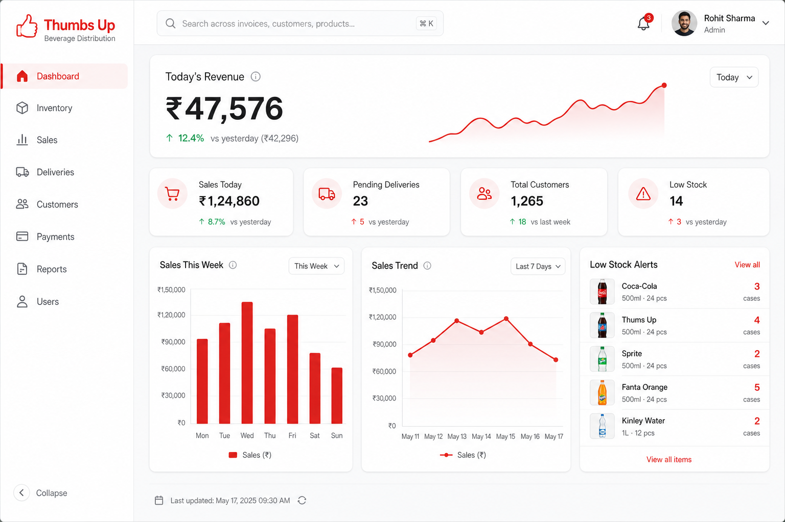
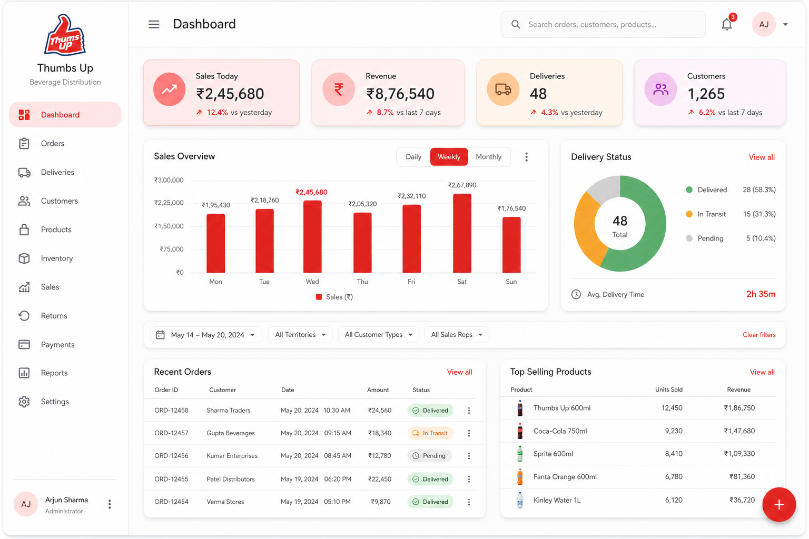
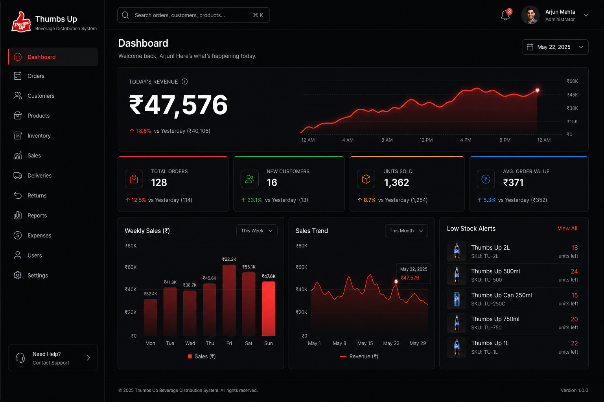
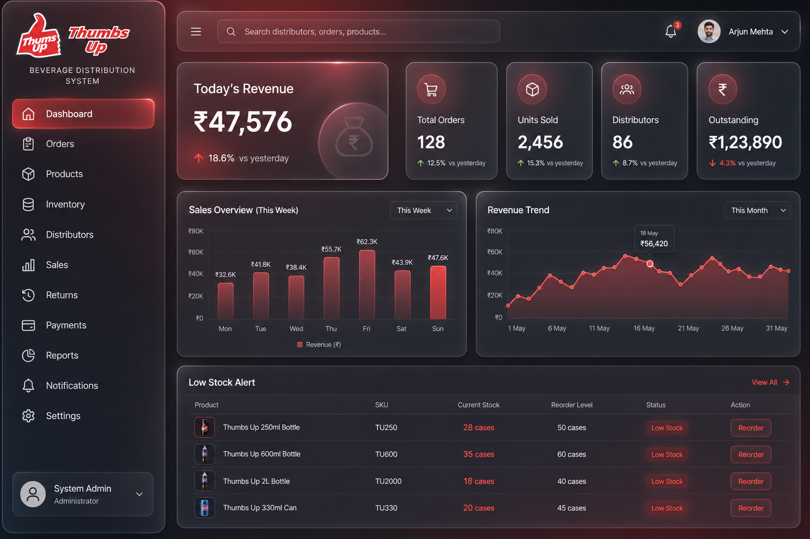
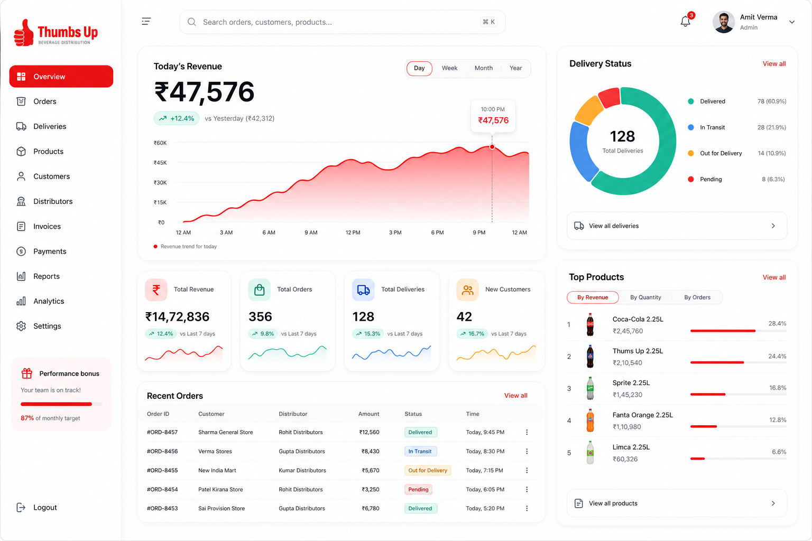
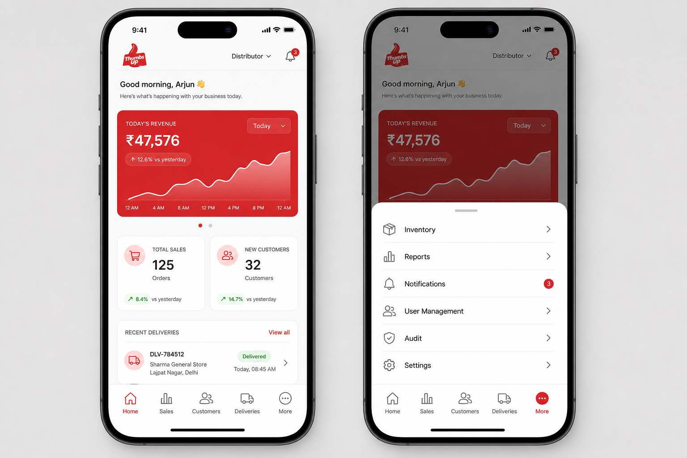
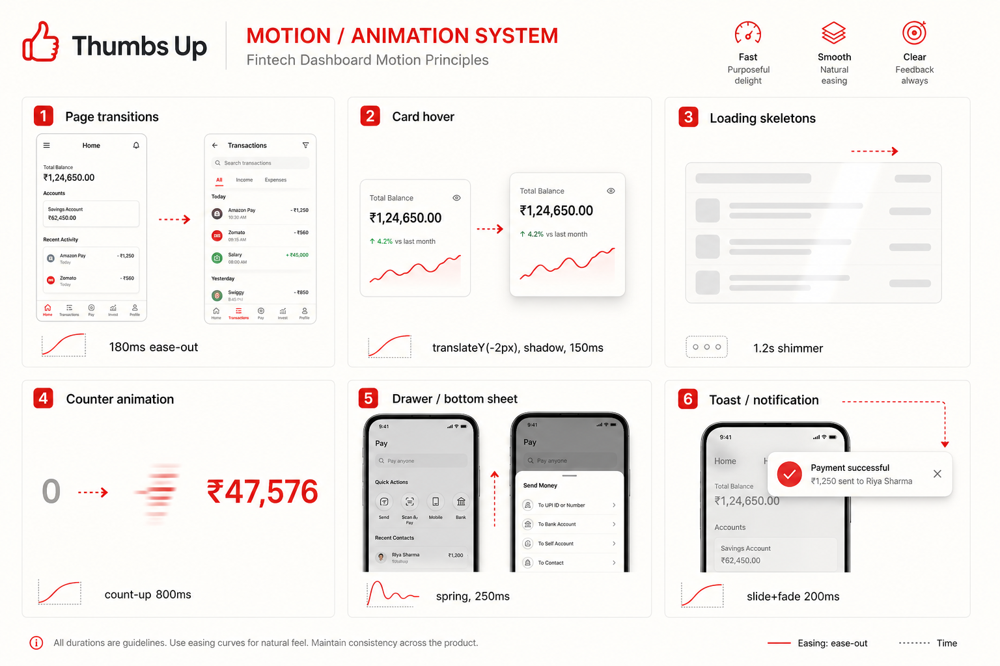

# Design Showcase — Thumbs Up Distribution System

**Author:** Senior Product Designer / UX Architect  
**Date:** 2026-05-30  
**Status:** Concepts for review — **no application code changed.** Mockups in `design-previews/`.

> Figma note: the connected Figma seat (`sainakka6@gmail.com`) is **View-only**, so editable Figma files could not be created via MCP. Deliverables are high-fidelity rendered mockups instead. Upgrade to an editor seat to regenerate as native Figma frames.

This builds on the findings in `UI_AUDIT_REPORT.md` (emoji icons, dashboard overload, weak hierarchy, low contrast, shouty uppercase, poor mobile tables/nav).

---

## Phase 2 — Five design concepts

### Concept A — Enterprise SaaS

Light, neutral, restrained. White cards on `#F7F8FA`, 1px borders, soft shadows, red used sparingly for primary actions and the active item. One **hero KPI** + a row of secondary stats + two charts. Inspired by Linear / Stripe / Vercel.

**Pros:** Maximum clarity & legibility; trustworthy/business-like; accessible contrast; fast to build with Tailwind; ages well.  
**Cons:** Can feel "safe"/generic; less brand drama; departs from today's dark theme.

### Concept B — Material Design 3

Material You: tonal containers, 16px radii, elevation, a FAB, navigation rail with pill active indicator, donut delivery status.

**Pros:** Familiar patterns; great component ecosystem; strong accessibility defaults; good for mixed web+Android.  
**Cons:** Looks like "default Google"; tonal containers + FAB read more consumer than enterprise; heavier visual texture.

### Concept C — Premium Dark Mode

Keeps the brand's dark DNA but elevates it: layered charcoals, thin colored top-accents on stat cards, a glowing red sparkline, high-contrast type. Inspired by Linear dark / Raycast.

**Pros:** Retains current dark identity (lowest change shock); premium, focused, great for long sessions / low light (warehouse/field use); brand red pops.  
**Cons:** Dark-only hurts readability in bright sunlight (delivery staff outdoors); charts/photos need careful contrast; harder to print/export.

### Concept D — Glassmorphism Enterprise

Frosted translucent panels with backdrop blur over a dark maroon→charcoal gradient; red glow through glass.

**Pros:** Striking, modern, memorable; strong brand atmosphere.  
**Cons:** Backdrop-blur is a **performance cost** (weak on low-end Android — the app's primary device class); translucency reduces text contrast and data legibility; hardest to keep accessible; trend-sensitive (dates faster).

### Concept E — Modern Fintech Dashboard ⭐

Crisp white cards, 20px radii, confident numbers, disciplined color (red + green positives), rich data-viz (gradient area chart, delivery donut, ranked top-products with mini-bars), pill toggles, trend chips (+12.4%). Inspired by Mercury / Ramp / Revolut Business.

**Pros:** Best **data storytelling** for a metrics-heavy distribution app; clear hierarchy; friendly yet professional; excellent on mobile; accessible contrast; scales to many screens.  
**Cons:** More components to build (chips, donuts, mini-bars); needs an icon set + chart library; light-first (mitigated by a dark variant = Concept C).

---

## Phase 3 — Screens (recommended concept)

Full screen set rendered in the recommended **Modern Fintech** language (`design-previews/`):

| # | Screen | Preview |
|---|--------|---------|
| 1 | Login | `recommended-1-login.png` |
| 2 | Dashboard | `recommended-2-dashboard.png` |
| 3 | Customers | `recommended-3-customers.png` |
| 4 | Inventory | `recommended-4-inventory.png` |
| 5 | Sales | `recommended-5-sales.png` |
| 6 | Deliveries | `recommended-6-deliveries.png` |
| 7 | Mobile Navigation | `recommended-7-mobile-nav.png` |

Each screen resolves specific audit issues:
- **Login** — removes the dead "Register" tab; adds brand storytelling + clear single sign-in.
- **Customers / Inventory / Deliveries** — replace horizontal-scroll tables with structured rows, avatars/thumbnails, status chips, and inline progress/timeline.
- **Sales** — guided form with live total + payment-mode segmented control + recent-sales rail.
- **Mobile nav** — 5 primary tabs **plus a "More" sheet** that surfaces Inventory, Reports, Notifications, User Management, Audit, Settings (fixes the mobile discoverability gap).

---

## Phase 4 — Animation system

| Motion | Spec | Where |
|--------|------|-------|
| **Page transitions** | fade + 8px slide-up, **180ms ease-out** | route changes |
| **Card hover** | `translateY(-2px)` + shadow lift, **150ms** | stat/list cards |
| **Loading skeletons** | shimmer sweep, **1.2s** loop | dashboard, lists, charts (already partly built) |
| **Counter animation** | count-up, **800ms ease-out** | dashboard KPIs (₹0 → ₹47,576) |
| **Drawer / bottom sheet** | spring slide, **~250ms** | mobile "More" sheet, modals |
| **Toast / notification** | slide + fade from top-right, **200ms** | success/error toasts, new alerts |

Principles: purposeful (never decorative), consistent easing (`ease-out` for enters), respect `prefers-reduced-motion`. Implementable with CSS transitions + a small lib (Framer Motion / `@formkit/auto-animate`) — deferred until approval.

---

## Phase 5 — Comparison & recommendation

| Criterion (1–5) | A Enterprise | B Material 3 | C Premium Dark | D Glass | E Fintech ⭐ |
|---|:---:|:---:|:---:|:---:|:---:|
| Clarity / hierarchy | 5 | 4 | 4 | 3 | 5 |
| Brand fit (Thumbs Up red) | 3 | 3 | 5 | 4 | 4 |
| Data storytelling | 4 | 4 | 4 | 3 | 5 |
| Mobile / field usability | 4 | 4 | 3 | 2 | 5 |
| Accessibility / contrast | 5 | 5 | 3 | 2 | 5 |
| Performance (low-end Android) | 5 | 4 | 4 | 2 | 5 |
| Implementation effort (Tailwind) | 5 | 3 | 4 | 3 | 4 |
| Distinctiveness | 2 | 2 | 4 | 5 | 4 |
| **Total / 40** | **33** | **29** | **31** | **24** | **37** |

### Recommendation: **Concept E (Modern Fintech) as the primary system, with Concept C (Premium Dark) as the built-in dark theme.**

**Why:**
- The product is **metrics-heavy** (sales, revenue, dues, stock, deliveries) — E's data storytelling and hierarchy directly fix the "dashboard overload, no focal point" audit finding.
- E is the strongest on **mobile and accessibility**, which matters for field/delivery users on low-end Android — where Glassmorphism (D) would underperform.
- Keeping **C as the dark variant** preserves brand continuity and serves low-light/warehouse use, so we don't lose what's good about today's dark theme. The two share one token set (just light/dark surfaces).
- Both reuse a single new **icon set** (Lucide), **type scale**, **spacing scale (4/8px)**, and **semantic color tokens** — so building E first makes C a theme toggle, not a rebuild.

**Suggested rollout (after approval):**
1. Foundations: tokens (color/spacing/type), Lucide icons, 2–3 elevations, focus states.
2. Primitives: Button, Card, StatCard, Chip/Badge, Table→responsive list, Input.
3. Screens in order: Login → Dashboard → Customers → Inventory → Sales → Deliveries → Notifications/Users.
4. Motion layer + dark theme (Concept C) toggle.

---

## ⏸ STOP — awaiting approval

No React, CSS, Tailwind, or other frontend code will be changed until you approve a direction. Reply with the concept you want (e.g. "Go with E + C dark variant") and I'll produce an implementation plan and start the foundations.
