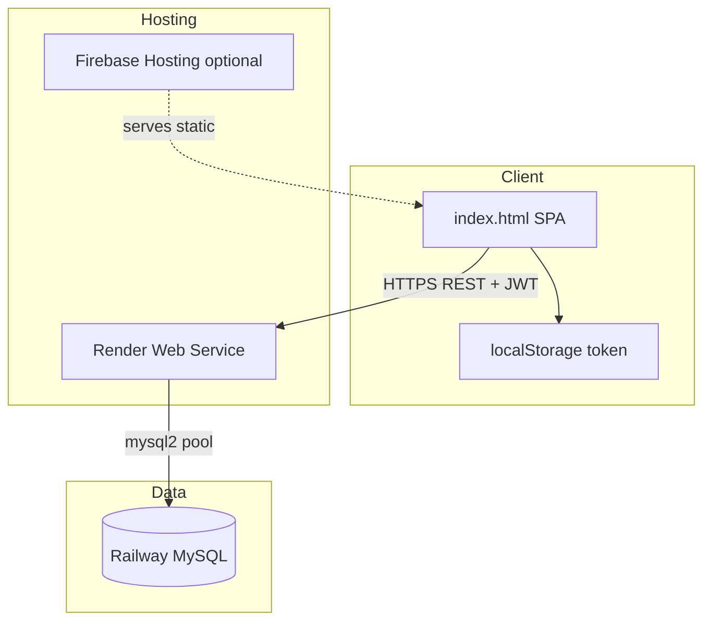

# ThumbsUpApp — System Architecture

**Project:** ThumbsUpApp (Distribution Management System)  
**Last updated:** 2026-05-28  
**Stack:** HTML/CSS/Vanilla JS · Node.js/Express · Railway MySQL · Render · Firebase Hosting (optional)

---

## 1. Overview

ThumbsUpApp is a single-page distribution management system for inventory, customers, sales, deliveries, and dashboard analytics. The frontend is a self-contained `index.html` file; the backend is a REST API in `server.js`; data persists in Railway MySQL.



---

## 2. Component architecture

| Layer | Technology | Location | Responsibility |
|-------|------------|----------|----------------|
| Presentation | HTML, CSS, Vanilla JS | `index.html` | Auth UI, SPA sections, API calls, charts/widgets |
| API | Express 5 | `server.js` | REST endpoints, JWT auth, business logic, SQL |
| Database | MySQL 9.x (Railway) | `railway` database | Persistent storage |
| Auth | `jsonwebtoken` | `server.js` | 1-hour Bearer tokens after login |
| Static hosting | Firebase Hosting | `firebase.json` | Optional CDN for `index.html` |
| API hosting | Render | `thumbs-backend.onrender.com` | Production Node server |

---

## 3. Frontend architecture

### 3.1 Application shell

Two top-level views:

1. **`#auth-screen`** — Login (signup tab disabled in UI).
2. **`#app`** — Main app with sidebar navigation and content sections.

Global loading overlay **`#loading`** is dismissed by `loadStats()` after `/products/stats` succeeds (with null-safe handling for empty inventory).

### 3.2 SPA sections

| Section ID | Nav label | Primary data loaders |
|------------|-----------|----------------------|
| `sec-dashboard` | Dashboard | `loadDashboard()`, `loadStats()`, dashboard API widgets |
| `sec-inventory` | Inventory | `loadProducts()`, `saveProduct()` |
| `sec-sales` | Sales Entry | `loadSales()`, `recordSale()` |
| `sec-deliveries` | Deliveries | `loadDeliveries()`, `saveDelivery()` |
| `sec-customers` | Customers | `loadCustomers()`, `saveCustomer()`, payments |

Navigation is handled by `navigate(section)`, which toggles `.section.active` and triggers section-specific loaders.

### 3.3 Client-side state

In-memory arrays (refreshed from API):

- `allProducts`
- `allCustomers`
- `allSales`
- `allDeliveries`

### 3.4 API integration pattern

- **Base URL (production):** `https://thumbs-backend.onrender.com`
- **Auth helper:** `fetchWithAuth(url, options)` adds `Authorization: Bearer <token>` from `localStorage`.
- **401 handling:** Clears token, shows auth screen, alerts session expired.
- **Login:** `POST /login` with `{ username, password }` (UI label says “Email” but sends `username`).

### 3.5 Auto-login

On page load, if `localStorage.token` exists, the app hides auth, shows `#app`, and calls `loadDashboard()` + `loadProducts(1)`.

---

## 4. Backend architecture

### 4.1 Middleware stack

```
Request → cors() → express.json() → [verifyToken] → route handler → mysql2 → response
```

- **`verifyToken`:** Required on all routes except `POST /login`.
- **Missing token:** `403` + `"No token"`
- **Invalid/expired token:** `401` + `"Invalid token"`

### 4.2 Route modules (logical)

| Module | Prefix / paths | Table(s) |
|--------|----------------|----------|
| Auth | `POST /login` | `users` |
| Products | `/products`, `/products/search/:key`, `/products/stats`, `/inventory` | `inventory` |
| Customers | `/customers`, `/customers/:id`, `/customers/:id/pay` | `customers` |
| Sales | `/sales`, `/sales/:id` | `sales`, `customers`, `inventory` |
| Deliveries | `/deliveries`, `/deliveries/:id` | `deliveries`, `customers` |
| Dashboard | `/dashboard/*` | `sales`, `customers` |

### 4.3 Transactional flows

**Sale (`POST /sales`):**

1. Insert row into `sales`.
2. Decrement `inventory.quantity` by sold qty (matches `Name`; strips `" (size)"` from UI product label).
3. Compute `due = total_amount - amount_paid`.
4. Update `customers.outstanding_balance` (+due or −overpayment).

**Payment (`POST /customers/:id/pay`):**

1. `SELECT ... FOR UPDATE` on customer.
2. Reduce `outstanding_balance` (floor at 0).

Both use MySQL transactions where applicable.

### 4.4 Server configuration

- Listens on **port 3000** (`app.listen(3000)`).
- DB connection via `mysql2/promise` connection pool (credentials should be moved to environment variables — see `DEPLOYMENT_GUIDE.md`).

---

## 5. Database architecture

See `DATABASE_SCHEMA.md` for full DDL and relationships.

**Tables:** `users`, `inventory`, `customers`, `sales`, `deliveries`

**Foreign keys:**

- `sales.customer_id` → `customers.id`
- `deliveries.customer_id` → `customers.id`

---

## 6. Security architecture

| Concern | Current implementation | Recommendation |
|---------|------------------------|----------------|
| API auth | JWT Bearer, 1h expiry | Move `SECRET` to env var |
| Password storage | Plaintext compare in DB | Use `bcrypt` (already in `package.json`) |
| DB credentials | Hardcoded in `server.js` | Railway env vars on Render |
| CORS | `cors()` open to all origins | Restrict in production if needed |
| Delivery DELETE | `verifyToken` enforced | Deploy latest `server.js` to Render |

---

## 7. Deployment topology

| Artifact | Platform | URL / path |
|----------|----------|------------|
| `index.html` | Firebase Hosting (optional) or static host | Project `vessel-35cca` per `.firebaserc` |
| `server.js` | Render Web Service | `https://thumbs-backend.onrender.com` |
| MySQL | Railway | Private TCP proxy host |

Frontend and backend are **decoupled**: frontend can be opened locally or on Firebase while always calling the Render API URL (hardcoded in `index.html`).

---

## 8. Supporting scripts (repo)

| Script | Purpose |
|--------|---------|
| `migrations/001-recovery-schema.sql` | Full schema DDL |
| `create_inventory.js` / `create_customers.js` / `create_sales_deliveries.js` | Stepwise table creation |
| `e2e-qa.mjs` | End-to-end API + Playwright QA |
| `security-check.mjs` | Delivery route JWT security tests |

---

## 9. Known design notes

1. **Product naming:** Inventory column is `` `Name` `` (capital N); sales reduce stock by matching this name.
2. **`opening_balance`:** Stored on customer create but not auto-applied to `outstanding_balance`.
3. **Pagination:** Products list returns 5 rows per page (`LIMIT 5`).
4. **Sales delete:** Does not restore inventory stock or reverse customer balance.
5. **bcrypt:** Listed in dependencies but not used in login flow yet.

---

## 10. Architecture diagram (request flow)

```mermaid
sequenceDiagram
    participant U as User Browser
    participant F as index.html
    participant A as Express API
    participant D as Railway MySQL

    U->>F: Open app
    F->>A: POST /login
    A->>D: SELECT users
    A-->>F: JWT token
    F->>F: localStorage.token

    U->>F: Record sale
    F->>A: POST /sales (Bearer)
    A->>D: BEGIN; INSERT sales; UPDATE inventory; UPDATE customers; COMMIT
    A-->>F: success
    F->>A: GET /products/stats
    A-->>F: stats JSON
    F->>F: Hide #loading, update dashboard
```
