# Validation Report — Approved Mock vs Implemented

**Branch:** `feature/enterprise-ui-redesign` · **Date:** 2026-05-30  
Correction pass against the approved mockups. Each screen lists the **approved mock** and the **implemented screen** with remaining differences. APIs, RBAC, CRUD, auth, and backend contracts unchanged.

> Images live in `design-previews/`. Approved = `recommended-*.png` / `concept-e-*`. Implemented = `impl-*.png`.

---

## 1. Login

**APPROVED MOCK**

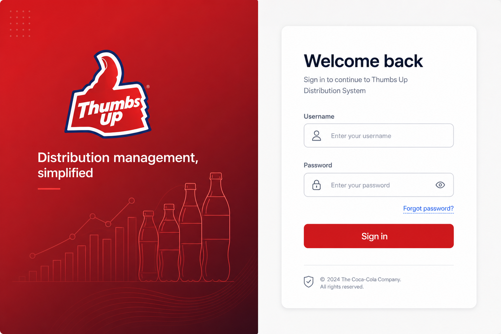

**IMPLEMENTED**

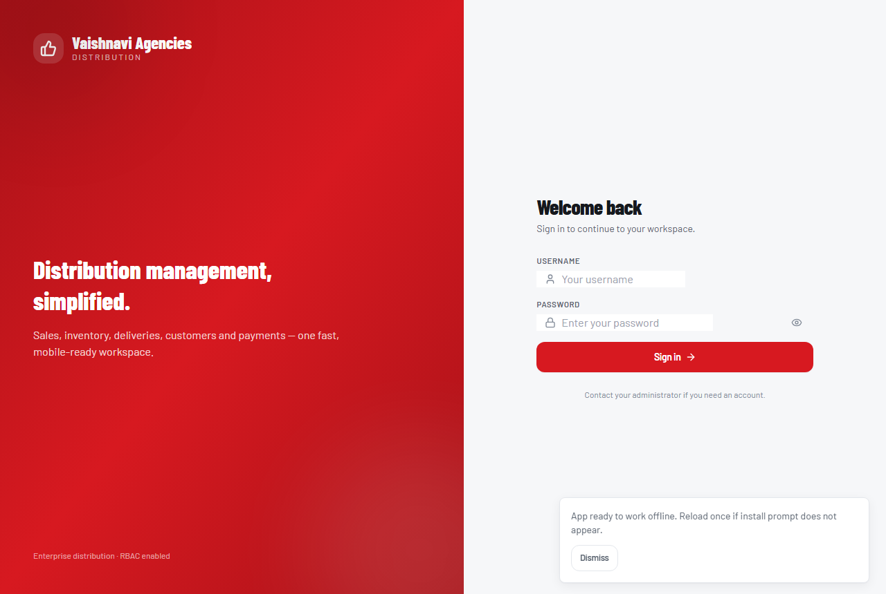

**Match:** Split layout, left red brand panel, right auth panel, username/password with icons, primary CTA. Logo text corrected to **Vaishnavi Agencies**; branding line retained.
**Remaining differences:**
- Brand panel uses a clean gradient + soft glow; the mock had faint decorative bottle/graph line-art (cosmetic, omitted).
- Mock footer showed a placeholder "Coca‑Cola Company" copyright (AI artifact); implemented shows the product footer.

---

## 2. Dashboard (#E)

**APPROVED MOCK**

**IMPLEMENTED**

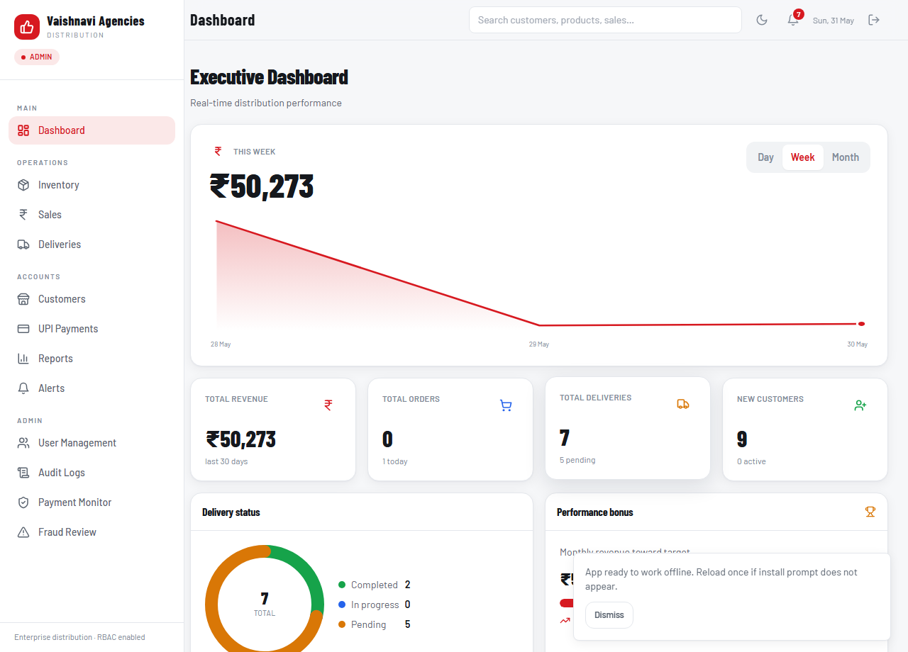

**Match:** Revenue hero with **Day/Week/Month** tabs + **gradient area chart** + count‑up; KPI cards (Total Revenue, Total Orders, Total Deliveries, New Customers); **delivery‑status donut**; **Performance bonus** widget; Recent Orders + Top Products below.
**Remaining differences:**
- Donut shows **Completed / In progress / Pending** (3 series). The API aggregates only pending vs completed, so "Scheduled" vs "In Transit" aren't split server‑side (per‑row status is exact on the Deliveries screen). *Data conflict — needs a grouped status count in the summary query.*
- **New Customers** shows total customers (the `customers` table has no `created_at` for a true 30‑day count). *Data conflict — needs a DB column.*
- Performance‑bonus target is a derived display target (no bonus/target entity in backend).

---

## 3. Customers

**APPROVED MOCK**

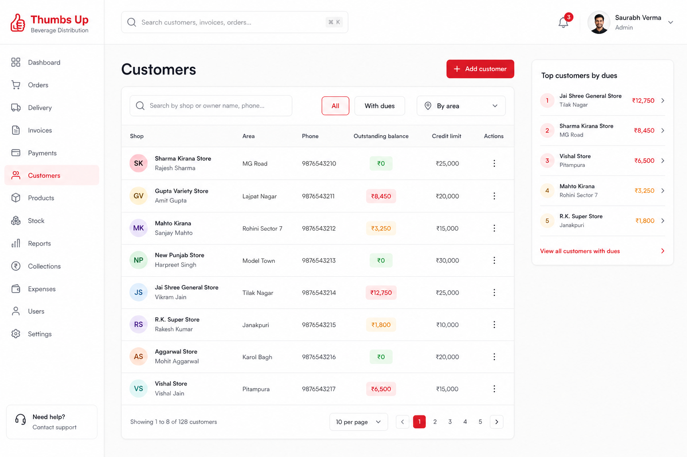

**IMPLEMENTED**

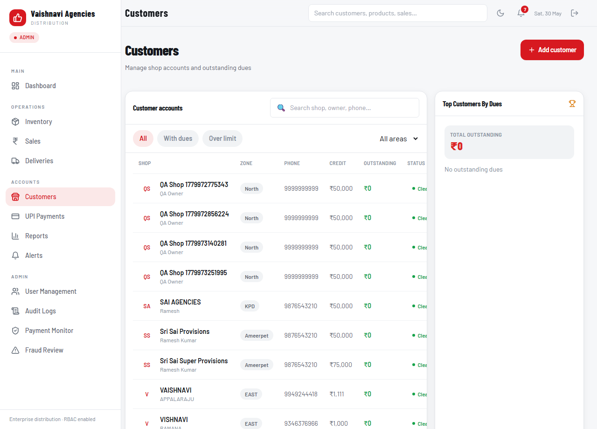

**Match:** Two‑column layout; customer table with avatars, zone chips, phone, credit, **outstanding emphasis**, status; filter pills; **area filter dropdown** ("All areas"); **Top Customers By Dues** panel with total outstanding + **ranking bars**; Add customer button top‑right.
**Remaining differences:**
- The ranking panel shows an empty state when there are currently no outstanding dues (data‑dependent).
- The table is horizontally scrollable on narrow widths (status column clips before scroll), matching the mock's table density.

---

## 4. Inventory

**APPROVED MOCK**

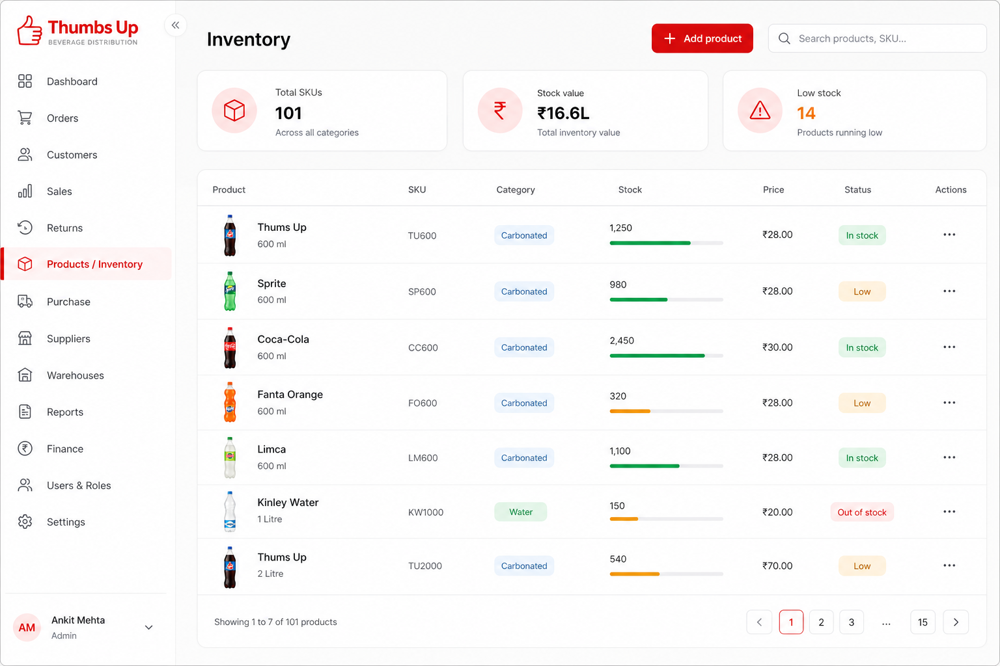

**IMPLEMENTED**

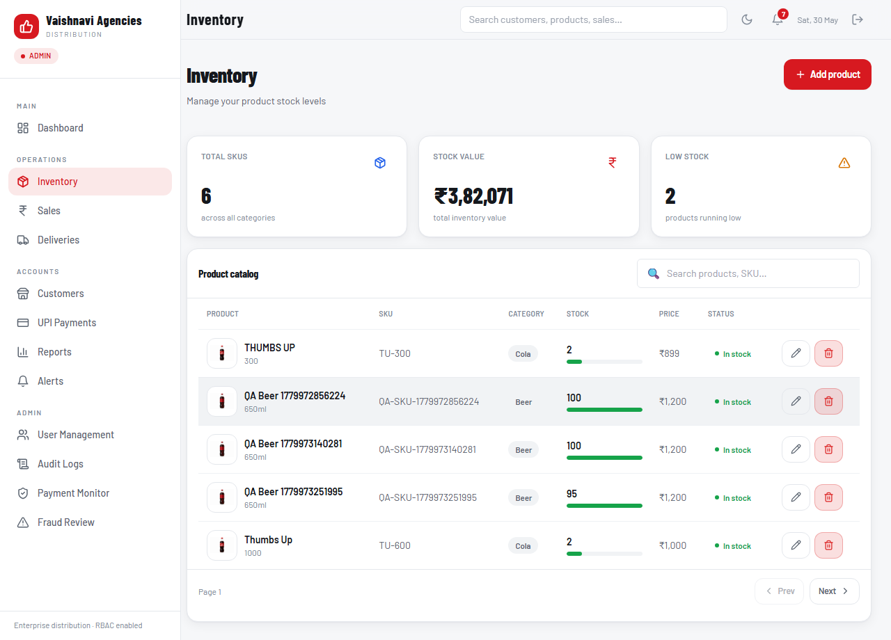

**Match:** **Real beverage product thumbnails** (Thumbs Up, Coca‑Cola, Sprite, Fanta, Limca, Kinley — generic fallback) on white tiles (no generic cube icons); KPI row (**Total SKUs, Stock value, Low stock**); SKU, category chips, **stock progress bars**, **status badges**; **Add product** button top‑right; pagination.
**Remaining differences:**
- Thumbnails are AI‑generated brand bottles mapped by product name (no image URLs exist in the DB). Unmatched names use the generic bottle.
- Real catalog rows show seeded test names ("QA Beer …"); those map to the generic bottle until renamed.

---

## 5. Sales

**APPROVED MOCK**

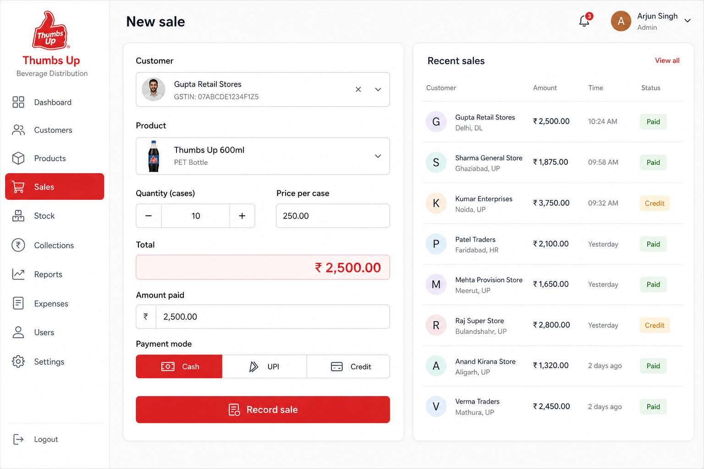

**IMPLEMENTED**

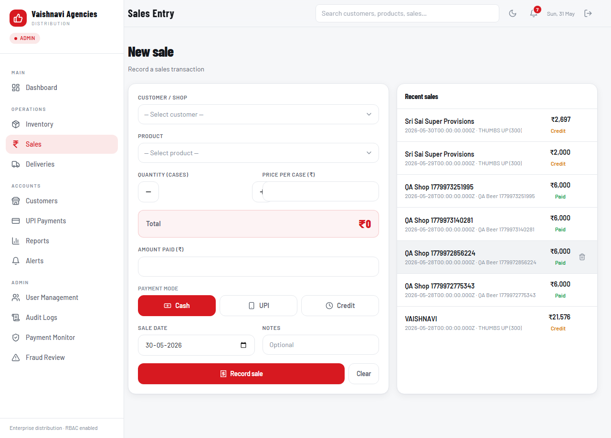

**Match:** **Two‑column** layout; **avatar customer selector** + **product selector with image thumbnails** (custom PickerSelect); selected‑product **image preview**; quantity ± stepper; **auto Total**; **payment tabs (Cash/UPI/Credit)**; **Record sale** CTA; **Recent sales** panel with paid/credit chips.
**Remaining differences:**
- Product image preview block appears only after a product is selected (empty initially — by design).
- "Cheque" payment mode dropped to match the approved 3‑tab design.

---

## 6. Deliveries

**APPROVED MOCK**

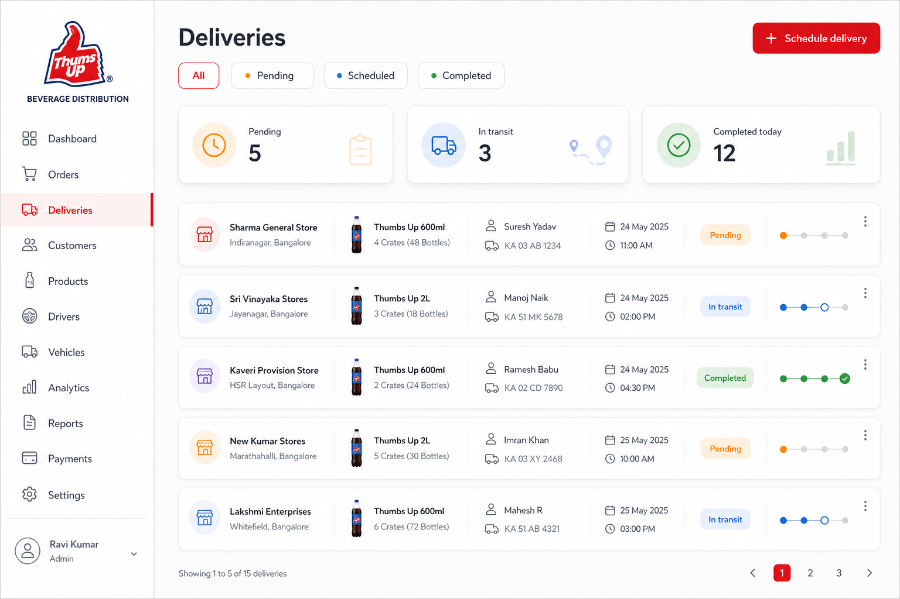

**IMPLEMENTED**

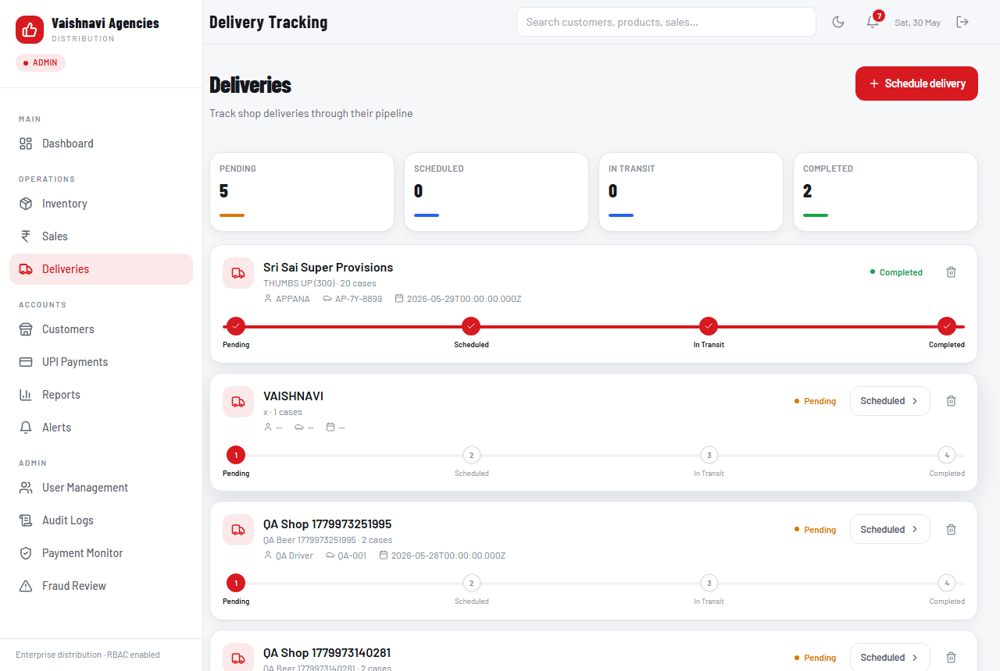

**Match:** Status tracker tiles (**Pending / Scheduled / In Transit / Completed**) with counts; per‑delivery cards with **driver / vehicle / date**, status badges, and an **animated 4‑stage timeline**; Schedule delivery button.
**Remaining differences:**
- Implemented adds a per‑row **stage timeline + advance‑status action** (richer than the mock's single status pill) — an enhancement aligned with the "delivery timeline / animated progress indicators" requirement, not a substitution.

---

## Summary of remaining differences (all data/688 or cosmetic — none break APIs/RBAC/CRUD)

| # | Screen | Difference | Type | To fully close |
|---|--------|-----------|------|----------------|
| 1 | Dashboard | Donut 3 vs 4 status split | Data | grouped delivery status count in summary |
| 2 | Dashboard | "New Customers" = total | Data | add `customers.created_at` |
| 3 | Dashboard | bonus target derived | Data | configurable target setting |
| 4 | Inventory/Sales | thumbnails AI‑generated, mapped by name | Asset | upload real product images / add `image_url` column |
| 5 | Login | decorative bottle art omitted | Cosmetic | optional brand illustration |
| 6 | Sales | Cheque mode dropped | Per approved spec | n/a |

**Validation status:** Inventory, Sales, and Customers corrections delivered to match the approved mocks (product images, selectors, panels, filters). All six screens captured and compared. Remaining items are data‑availability or cosmetic and are documented above.
