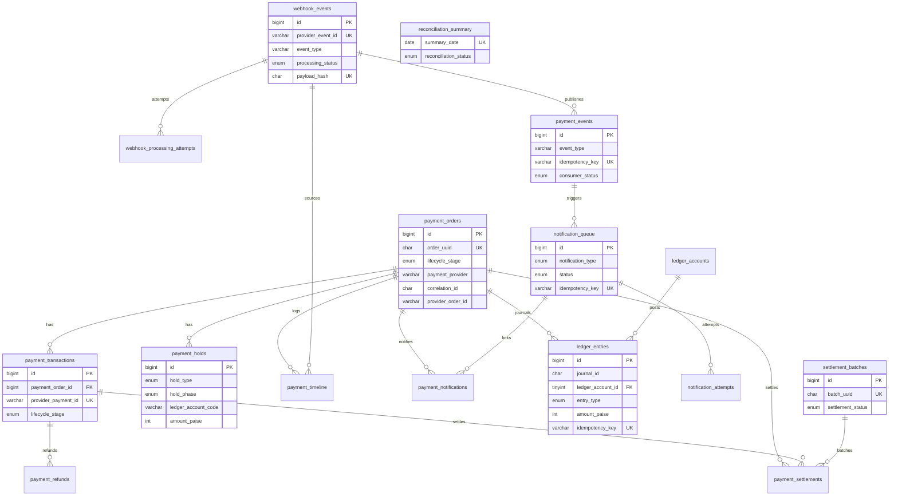
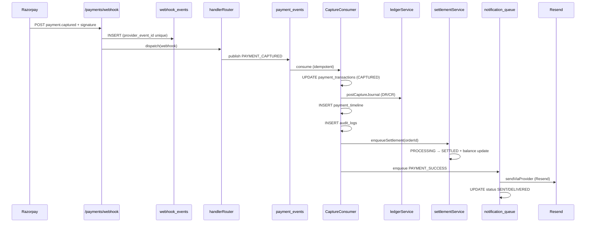
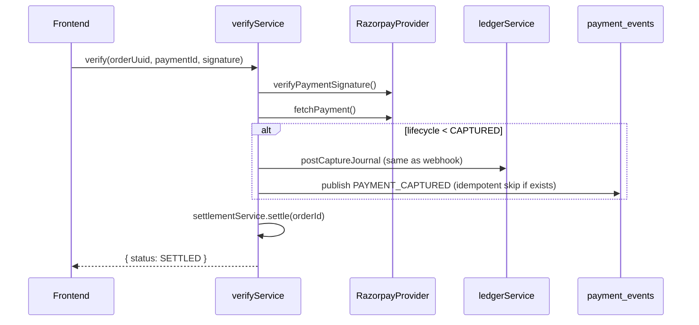

# Payment Ledger Platform — Architecture & Implementation Plan

**Role:** Principal FinTech / Payments / Ledger Architecture  
**Scope:** Redesign ThumbsUpApp Razorpay integration into a production-grade, audit-ready, lightweight fintech ledger  
**Constraints:** Free-tier compatible (Render + Railway MySQL + Resend + Socket.IO). No enterprise GL.  
**Migration:** `migrations/012-payment-ledger-platform.sql` → `npm run migrate:ledger`

---

## Executive summary

The current integration (`payments/services/paymentService.js`) treats webhooks as status flags. It does not settle ledgers, finalize transactions, reconcile refunds, or produce audit-grade trails. This design introduces:

1. **Store-first webhooks** (`webhook_events` → process → internal bus)
2. **Double-entry ledger** (4 accounts, journal-based `ledger_entries`)
3. **Hold-based money movement** (`payment_holds`: inquire → hold → enact)
4. **Event sourcing** (replay webhooks and internal `payment_events`)
5. **Notification queue** (Resend + delivery tracking)
6. **Reconciliation jobs** (orphan / missing settlement / missing ledger detectors)
7. **Provider abstraction** (Razorpay today; Cashfree / PhonePe / Stripe / PayU later)

---

## Success criteria → data sources

| Question | Answer location |
|----------|-----------------|
| Did the customer pay? | `payment_orders.lifecycle_stage` ≥ `CAPTURED`, `payment_timeline`, `webhook_events` |
| Was payment captured? | `payment_transactions.lifecycle_stage = CAPTURED`, `payment.captured` in `webhook_events` |
| Was settlement completed? | `payment_settlements.settlement_status = SETTLED`, `ledger_entries` journal, `lifecycle_stage = SETTLED` |
| Was email sent? | `notification_queue` + `notification_attempts` + `payment_notifications` |
| Was refund processed? | `payment_refunds.lifecycle_stage = PROCESSED`, `refund.processed` webhook, ledger reversal journal |
| What ledger entries were created? | `ledger_entries` WHERE `payment_order_id = ?` |
| What webhook triggered action? | `payment_timeline.webhook_event_id` → `webhook_events` |
| Can event be replayed safely? | `webhook_events` idempotent on `(provider, provider_event_id)`; replay sets `processing_status = REPLAYED` |

---

## ER diagram



---

## Chart of accounts (lightweight ledger)

| Code | Type | Normal | Purpose |
|------|------|--------|---------|
| `CUSTOMER_RESERVE` | LIABILITY | CREDIT | Offsets customer `outstanding_balance` (AR reduction) |
| `PLATFORM_HOLDING` | ASSET | DEBIT | Funds captured by gateway, not yet settled |
| `MERCHANT_SETTLEMENT` | ASSET | DEBIT | Cleared funds available for merchant payout |
| `REFUND` | LIABILITY | CREDIT | Refund obligations / processing |

### Journal patterns

**On CAPTURED (payment.captured / order.paid):**
```
DR  PLATFORM_HOLDING      amount
CR  CUSTOMER_RESERVE      amount
```
Idempotency key: `capture:{provider_payment_id}`

**On SETTLED (settlement job / enact):**
```
DR  MERCHANT_SETTLEMENT  amount
CR  PLATFORM_HOLDING      amount
```
Idempotency key: `settle:{payment_order_id}`

**On REFUND PROCESSED:**
```
DR  REFUND                amount
CR  MERCHANT_SETTLEMENT   amount  (or PLATFORM_HOLDING if not yet settled)
```
Idempotency key: `refund:{provider_refund_id}`

Every journal MUST balance: sum(DR paise) = sum(CR paise).

---

## Payment lifecycle

```
PENDING → AUTHORIZED → RESERVED → CAPTURED → PROCESSING → SETTLED
                              ↘ FAILED
                              ↘ REFUNDED
```

| Stage | Trigger | Hold phase | Ledger |
|-------|---------|------------|--------|
| `PENDING` | `POST /payments/create-order` | — | — |
| `AUTHORIZED` | `payment.authorized` webhook | `credit.inquire` | — |
| `RESERVED` | After inquire passes | `credit.hold` on PLATFORM_HOLDING | — |
| `CAPTURED` | `payment.captured` / `order.paid` | `credit.enact` (partial) | Capture journal |
| `PROCESSING` | Settlement job started | `debit.hold` on CUSTOMER_RESERVE | — |
| `SETTLED` | Settlement enact complete | `debit.enact` | Settlement journal + `customers.outstanding_balance -= amount` |
| `FAILED` | `payment.failed` | Release holds | — |
| `REFUNDED` | `refund.processed` | `debit.enact` on REFUND | Reversal journal |

Legacy `payment_orders.status` remains for backward compatibility during migration; new code writes both `status` and `lifecycle_stage`.

---

## Hold-based money movement

Service: `payments/ledger/holdService.js`

```
credit.inquire(order, amount)  → validate amount, customer, fraud, limits
credit.hold(order, amount)     → INSERT payment_holds (CREDIT, HOLD, PLATFORM_HOLDING)
credit.enact(holdId)           → transition hold ENACTED, post ledger if CAPTURED

debit.inquire(order, amount)   → validate refund eligibility, settled balance
debit.hold(order, amount)      → INSERT payment_holds (DEBIT, HOLD, REFUND)
debit.enact(holdId)            → call provider refund API, post reversal ledger
```

All hold transitions write `payment_timeline` + `audit_logs`.

---

## Service architecture

```
┌─────────────────────────────────────────────────────────────────────────┐
│                         HTTP / Socket Layer                              │
│  paymentRoutes.js  adminRoutes.js  webhookRoute (payments/index.js)     │
└───────────────────────────────┬─────────────────────────────────────────┘
                                │
┌───────────────────────────────▼─────────────────────────────────────────┐
│                      Application Services                                │
│  orderService          verifyService        refundService               │
│  settlementService     reconciliationService notificationOrchestrator   │
└───────────────────────────────┬─────────────────────────────────────────┘
                                │
        ┌───────────────────────┼───────────────────────┐
        ▼                       ▼                       ▼
┌───────────────┐     ┌─────────────────┐     ┌─────────────────────┐
│ Webhook Layer │     │  Event Bus      │     │  Ledger Layer       │
│ ingestService │────▶│  eventPublisher │────▶│  ledgerService      │
│ replayService │     │  eventConsumers │     │  holdService        │
│ handlerRouter │     │                 │     │  journalService     │
└───────┬───────┘     └─────────────────┘     └─────────────────────┘
        │
┌───────▼───────────────────────────────────────────────────────────────┐
│ Provider Abstraction                                                     │
│  PaymentProvider (interface)                                             │
│  ├── razorpay/RazorpayProvider (orders, verify, refund, fetch)          │
│  ├── cashfree/CashfreeProvider (stub)                                     │
│  ├── phonepe/PhonePeProvider (stub)                                     │
│  └── stripe/StripeProvider (stub)                                        │
└─────────────────────────────────────────────────────────────────────────┘
                                │
┌───────────────────────────────▼─────────────────────────────────────────┐
│ Repository Layer                                                         │
│  orderRepo transactionRepo holdRepo ledgerRepo webhookRepo              │
│  eventRepo settlementRepo refundRepo notificationRepo auditRepo         │
│  timelineRepo reconciliationRepo                                        │
└───────────────────────────────┬─────────────────────────────────────────┘
                                ▼
                          MySQL (Railway)
```

---

## Webhook processing (store-first)

### Pipeline

```
POST /payments/webhook
  1. Extract correlation_id (X-Request-Id or generate UUID)
  2. verifyWebhookSignature(rawBody, signature)
  3. Parse payload → extract provider_event_id (NEVER use event_type alone)
  4. INSERT webhook_events (status=RECEIVED) — UNIQUE(provider, provider_event_id)
     → on duplicate: return 200 { ok: true, duplicate: true }
  5. UPDATE webhook_events SET signature_valid=1, processing_status=VALIDATED
  6. INSERT webhook_processing_attempts (attempt_no=1, STARTED)
  7. handlerRouter.dispatch(event_type, webhookEvent)
       → publish internal payment_events (idempotent)
       → consumers update orders, holds, ledger, timeline, notifications
  8. UPDATE webhook_events SET processing_status=PROCESSED, processed_at=NOW()
  9. Return HTTP 200
```

### Idempotency keys (mandatory)

| Layer | Key format | Never use |
|-------|------------|-----------|
| Webhook store | `(payment_provider, provider_event_id)` | `event_type` alone |
| Internal event | `evt:{provider}:{provider_event_id}:{event_type}` | — |
| Ledger journal | `{action}:{provider_payment_id}` or `{action}:{order_id}` | — |
| Notification | `notify:{type}:{payment_order_id}:{recipient}` | — |

### Event handlers

| Razorpay event | Handler | Internal event published |
|----------------|---------|--------------------------|
| `payment.authorized` | `AuthorizedHandler` | `PAYMENT_AUTHORIZED` |
| `payment.captured` | `CapturedHandler` | `PAYMENT_CAPTURED` |
| `payment.failed` | `FailedHandler` | `PAYMENT_FAILED` |
| `order.paid` | `OrderPaidHandler` | `ORDER_PAID` (dedupe with captured via payment_id) |
| `refund.created` | `RefundCreatedHandler` | `REFUND_CREATED` |
| `refund.processed` | `RefundProcessedHandler` | `REFUND_COMPLETED` |

Entity extraction must support:
- `payload.payment.entity`
- `payload.order.entity`
- `payload.refund.entity`

### Replay

`POST /admin/payments/webhooks/:id/replay` (admin only):
1. Load `webhook_events` by id
2. Set `processing_status = REPLAYED`
3. Re-run handlerRouter with `event_source = REPLAY`
4. All downstream writes remain idempotent via keys above

---

## Internal event bus

Table: `payment_events`

| Internal event | Consumer(s) | Side effects |
|----------------|-------------|--------------|
| `PAYMENT_AUTHORIZED` | `AuthorizationConsumer` | lifecycle → AUTHORIZED, credit.inquire+hold, timeline, audit |
| `PAYMENT_CAPTURED` | `CaptureConsumer` | lifecycle → CAPTURED, update tx, capture journal, enqueue PAYMENT_SUCCESS |
| `PAYMENT_FAILED` | `FailureConsumer` | lifecycle → FAILED (never downgrade SETTLED), release holds, PAYMENT_FAILED notify |
| `ORDER_PAID` | `OrderPaidConsumer` | Same as captured if not already CAPTURED (dedupe by payment_id) |
| `REFUND_CREATED` | `RefundCreatedConsumer` | payment_refunds CREATED, debit.inquire+hold, REFUND_CREATED notify |
| `REFUND_COMPLETED` | `RefundCompletedConsumer` | refund PROCESSED, reversal ledger, order REFUNDED, REFUND_COMPLETED notify |
| `SETTLEMENT_COMPLETED` | `SettlementConsumer` | lifecycle → SETTLED, settlement journal, balance update, SETTLEMENT_COMPLETED notify |

Webhook handlers **only publish** to `payment_events`. They never send email or update ledger directly.

---

## Sequence: payment.captured (webhook-only success)



---

## Sequence: POST /payments/verify (client callback)



Verify and webhook converge on **shared** `captureService` and `settlementService` — no duplicate logic.

---

## Reconciliation jobs

Run via Render Cron Job (free) or `node scripts/run-reconciliation.js` daily.

| Job | Detector | Action |
|-----|----------|--------|
| `missing-settlement` | `lifecycle_stage = CAPTURED` AND age > 15m AND no `payment_settlements` | Auto-settle or flag CRITICAL |
| `missing-ledger` | `lifecycle_stage >= CAPTURED` AND no `ledger_entries` for order | Replay internal event / alert |
| `missing-refund` | `payment_refunds.lifecycle = PENDING` AND age > 1h | Poll Razorpay / alert |
| `orphan-payment` | Razorpay payment_id not in DB | Insert orphan record in `reconciliation_summary.details` |
| `missing-notification` | SETTLED order AND no `payment_notifications` PAYMENT_SUCCESS | Re-enqueue notification |

Output: upsert `reconciliation_summary` per day per provider.

---

## API contracts

### Existing (modified behavior)

#### `POST /payments/create-order`
```json
// Request
{ "amount": 1500, "customerId": 1, "idempotencyKey": "tu_...", "description": "..." }

// Response
{
  "success": true,
  "order": {
    "orderUuid": "uuid",
    "lifecycleStage": "PENDING",
    "correlationId": "uuid",
    "razorpayOrderId": "order_xxx",
    "razorpayKeyId": "rzp_xxx",
    "amountPaise": 150000
  }
}
```

#### `POST /payments/verify`
Unchanged request. Response adds `lifecycleStage: "SETTLED"` when full settlement completes.

#### `POST /payments/webhook`
No request body change. Response:
```json
{ "ok": true, "webhookEventId": 123, "duplicate": false }
```

### New admin APIs

| Method | Path | Purpose |
|--------|------|---------|
| `GET` | `/admin/payments/timeline/:orderUuid` | Full `payment_timeline` |
| `GET` | `/admin/payments/ledger/:orderUuid` | `ledger_entries` for order |
| `GET` | `/admin/payments/reconciliation` | `reconciliation_summary` |
| `POST` | `/admin/payments/webhooks/:id/replay` | Replay stored webhook |
| `GET` | `/admin/payments/notifications/:orderUuid` | Notification audit trail |
| `POST` | `/admin/reconciliation/run` | Manual reconciliation trigger |

---

## Repository layer (new files)

| File | Responsibility |
|------|----------------|
| `payments/repositories/ledgerRepository.js` | Accounts, entries, journal queries |
| `payments/repositories/holdRepository.js` | payment_holds CRUD |
| `payments/repositories/webhookEventRepository.js` | webhook_events + attempts |
| `payments/repositories/paymentEventRepository.js` | payment_events bus |
| `payments/repositories/timelineRepository.js` | payment_timeline |
| `payments/repositories/settlementRepository.js` | settlements + batches |
| `payments/repositories/notificationRepository.js` | queue + attempts + payment_notifications |
| `payments/repositories/reconciliationRepository.js` | reconciliation_summary |
| `payments/repositories/unifiedAuditRepository.js` | audit_logs (replaces direct payment_audit_logs for new writes) |

**Modify:** `paymentRepository.js` — add lifecycle, correlation, provider fields.

---

## Service layer (new files)

| File | Responsibility |
|------|----------------|
| `payments/providers/PaymentProvider.js` | Interface: createOrder, verify, refund, fetchPayment, parseWebhook |
| `payments/providers/razorpay/RazorpayProvider.js` | Move from razorpayService.js |
| `payments/providers/ProviderRegistry.js` | `getProvider('razorpay')` |
| `payments/ledger/ledgerService.js` | postJournal, validateBalance |
| `payments/ledger/holdService.js` | inquire/hold/enact for debit+credit |
| `payments/ledger/journalService.js` | Double-entry builder |
| `payments/webhooks/webhookIngestService.js` | Store-first ingest |
| `payments/webhooks/webhookHandlerRouter.js` | Route event_type → handler |
| `payments/webhooks/handlers/*.js` | Per-event handlers |
| `payments/webhooks/webhookReplayService.js` | Admin replay |
| `payments/events/eventPublisher.js` | Insert payment_events |
| `payments/events/consumers/*.js` | Internal event consumers |
| `payments/settlement/settlementService.js` | CAPTURED → SETTLED pipeline |
| `payments/notifications/notificationOrchestrator.js` | Queue + Resend dispatch |
| `payments/notifications/templates/*.js` | Email templates |
| `payments/reconciliation/reconciliationService.js` | All detectors |
| `payments/reconciliation/jobs/*.js` | Job entry points |
| `payments/services/orderService.js` | Extracted from paymentService |
| `payments/services/verifyService.js` | Extracted from paymentService |
| `payments/services/refundService.js` | Extracted from paymentService |

**Deprecate gradually:** `webhookReplayGuard.js` (replaced by `webhook_events` unique keys), `paymentService.processWebhook` (replaced by ingest + router).

---

## Notification framework (Resend)

Reuse: `lib/email/emailService.js` → `sendViaProvider()` / `resendProvider.sendMail()`

Flow:
1. Consumer enqueues `notification_queue` (status=PENDING)
2. `notificationWorker` (cron or in-process on Render) picks PENDING rows
3. Sends via Resend; records `notification_attempts`
4. Updates status SENT → DELIVERED (on Resend success response)
5. Links via `payment_notifications`

Templates (`payments/notifications/templates/`):
- `paymentSuccess.js`
- `paymentFailed.js`
- `refundCreated.js`
- `refundCompleted.js`
- `settlementCompleted.js`

Socket.IO remains a secondary channel (status=PENDING channel=SOCKET) for real-time UI.

---

## Security requirements

| Control | Implementation |
|---------|----------------|
| Webhook signature | `RazorpayProvider.verifyWebhookSignature` (existing HMAC) |
| Replay protection | `UNIQUE(provider, provider_event_id)` + `payload_hash` |
| Correlation IDs | `X-Correlation-Id` middleware → all logs + DB rows |
| Structured logging | pino with `{ correlationId, paymentOrderId, webhookEventId }` |
| Rate limiting | Existing `webhookLimiter` (keep) |
| Secret management | Render env vars only; never expose KEY_SECRET |
| Failure guard | Never downgrade SETTLED → FAILED |
| Amount validation | Compare provider amount vs `order.amount_paise` before ledger post |

---

## Provider abstraction interface

```javascript
// payments/providers/PaymentProvider.js
class PaymentProvider {
  get name() { throw new Error('not implemented'); }
  async createOrder({ amountPaise, receipt, notes }) {}
  verifyPaymentSignature({ orderId, paymentId, signature }) {}
  verifyWebhookSignature(rawBody, signature) {}
  async fetchPayment(paymentId) {}
  async createRefund({ paymentId, amountPaise, notes }) {}
  parseWebhookPayload(payload) {
    // returns { providerEventId, eventType, orderId, paymentId, refundId, amountPaise, entity }
  }
}
```

Future providers implement the same interface; `payment_orders.payment_provider` selects implementation.

---

## Implementation plan (dependency order)

### Phase 0 — Schema & foundations (no behavior change)
- [ ] Run `npm run migrate:ledger`
- [ ] Add `payments/lib/correlation.js` middleware
- [ ] Seed verification queries

**Files:** `migrations/012-*`, `scripts/run-ledger-platform-migration.js` ✅ created

### Phase 1 — Repository layer
- [ ] Create all repository files listed above
- [ ] Extend `paymentRepository.js` with lifecycle helpers
- [ ] Unit-test idempotency inserts against DB

**Depends on:** Phase 0

### Phase 2 — Ledger core
- [ ] `ledgerService`, `journalService`, `holdService`
- [ ] Post capture + settlement + refund journals
- [ ] Wire `audit_logs` + `payment_timeline` on every financial write

**Depends on:** Phase 1

### Phase 3 — Provider abstraction
- [ ] `PaymentProvider` interface + `RazorpayProvider` (migrate `razorpayService.js`)
- [ ] `ProviderRegistry`
- [ ] Update `orderService` to use registry

**Depends on:** Phase 1

### Phase 4 — Webhook store-first + replay
- [ ] `webhookIngestService` (store before process)
- [ ] Fix idempotency: use `provider_event_id` NOT `event_type`
- [ ] `webhookHandlerRouter` + 6 handlers
- [ ] `webhookReplayService` + admin replay endpoint
- [ ] Remove / bypass broken `webhookReplayGuard` event_id logic

**Depends on:** Phase 2, 3

### Phase 5 — Internal event bus
- [ ] `eventPublisher` + consumers
- [ ] Webhook handlers publish only; consumers do ledger/settlement/notify

**Depends on:** Phase 4

### Phase 6 — Settlement pipeline
- [ ] `settlementService`: CAPTURED → PROCESSING → SETTLED
- [ ] Update `customers.outstanding_balance` only in SETTLED enact
- [ ] `payment_settlements` + optional `settlement_batches`

**Depends on:** Phase 2, 5

### Phase 7 — Verify path convergence
- [ ] `verifyService` calls shared `captureService` + `settlementService`
- [ ] Remove early-return duplicate bug (settle even if webhook already CAPTURED)

**Depends on:** Phase 6

### Phase 8 — Refund completeness
- [ ] `refundService` + `refund.processed` handler
- [ ] Reversal ledger + balance restore
- [ ] Fix dual-approval bypass

**Depends on:** Phase 5, 6

### Phase 9 — Notification queue
- [ ] `notificationOrchestrator` + templates
- [ ] Resend integration via existing `emailService`
- [ ] `notificationWorker` (Render cron every 5 min)
- [ ] `payment_notifications` linkage

**Depends on:** Phase 5

### Phase 10 — Reconciliation
- [ ] `reconciliationService` + 4 detectors
- [ ] `scripts/run-reconciliation.js` + Render cron
- [ ] `reconciliation_summary` daily upsert
- [ ] Admin dashboard endpoints

**Depends on:** Phase 6, 8, 9

### Phase 11 — Deprecation & cleanup
- [ ] Redirect `paymentService.js` → thin facade over new services
- [ ] Migrate `payment_webhooks` reads to `webhook_events` in admin UI
- [ ] Update `PAYMENTS_DEPLOYMENT.md`, Postman, swagger
- [ ] Frontend: show `lifecycleStage` + timeline in admin

**Depends on:** All above

---

## Files to create

```
migrations/012-payment-ledger-platform.sql                    ✅
scripts/run-ledger-platform-migration.js                      ✅
docs/payments/LEDGER_PLATFORM_ARCHITECTURE.md                 ✅
scripts/run-reconciliation.js
payments/lib/correlation.js
payments/providers/PaymentProvider.js
payments/providers/ProviderRegistry.js
payments/providers/razorpay/RazorpayProvider.js
payments/ledger/ledgerService.js
payments/ledger/holdService.js
payments/ledger/journalService.js
payments/webhooks/webhookIngestService.js
payments/webhooks/webhookHandlerRouter.js
payments/webhooks/webhookReplayService.js
payments/webhooks/handlers/authorizedHandler.js
payments/webhooks/handlers/capturedHandler.js
payments/webhooks/handlers/failedHandler.js
payments/webhooks/handlers/orderPaidHandler.js
payments/webhooks/handlers/refundCreatedHandler.js
payments/webhooks/handlers/refundProcessedHandler.js
payments/events/eventPublisher.js
payments/events/consumers/authorizationConsumer.js
payments/events/consumers/captureConsumer.js
payments/events/consumers/failureConsumer.js
payments/events/consumers/orderPaidConsumer.js
payments/events/consumers/refundCreatedConsumer.js
payments/events/consumers/refundCompletedConsumer.js
payments/events/consumers/settlementConsumer.js
payments/settlement/settlementService.js
payments/settlement/captureService.js
payments/notifications/notificationOrchestrator.js
payments/notifications/notificationWorker.js
payments/notifications/templates/paymentSuccess.js
payments/notifications/templates/paymentFailed.js
payments/notifications/templates/refundCreated.js
payments/notifications/templates/refundCompleted.js
payments/notifications/templates/settlementCompleted.js
payments/reconciliation/reconciliationService.js
payments/reconciliation/jobs/missingSettlement.js
payments/reconciliation/jobs/missingLedger.js
payments/reconciliation/jobs/missingRefund.js
payments/reconciliation/jobs/orphanPayment.js
payments/services/orderService.js
payments/services/verifyService.js
payments/services/refundService.js
payments/repositories/ledgerRepository.js
payments/repositories/holdRepository.js
payments/repositories/webhookEventRepository.js
payments/repositories/paymentEventRepository.js
payments/repositories/timelineRepository.js
payments/repositories/settlementRepository.js
payments/repositories/notificationRepository.js
payments/repositories/reconciliationRepository.js
payments/repositories/unifiedAuditRepository.js
```

## Files to modify

```
package.json                                                  ✅ migrate:ledger
payments/index.js                     → wire correlation, new webhook ingest
payments/routes/paymentRoutes.js      → delegate to order/verify/refund services
payments/routes/adminRoutes.js        → timeline, ledger, replay, reconciliation
payments/repositories/paymentRepository.js → lifecycle + provider fields
payments/services/paymentService.js   → thin facade (Phase 11)
payments/services/razorpayService.js  → deprecate → RazorpayProvider
payments/services/webhookReplayGuard.js → deprecate
config/paymentConfig.js               → provider selection env
.env.example                            → PAYMENT_PROVIDER=razorpay
PAYMENTS_DEPLOYMENT.md                  → new tables, cron, webhook events
postman/ThumbsUp_Postman_Collection.json
swagger.json
frontend/src/services/paymentService.js → lifecycleStage in responses
frontend/src/pages/admin/AdminPaymentsPage.jsx → timeline + reconciliation
```

---

## Webhook event matrix (target state)

| Event | Handler | Order | Transaction | Holds | Ledger | Balance | Notification | Final state |
|-------|---------|-------|-------------|-------|--------|---------|--------------|-------------|
| `payment.authorized` | Authorized | AUTHORIZED | PENDING | credit HOLD | — | — | — | AUTHORIZED |
| `payment.captured` | Captured | CAPTURED | CAPTURED | credit ENACT | Capture journal | — | PAYMENT_SUCCESS (queued) | CAPTURED |
| `payment.failed` | Failed | FAILED* | FAILED | RELEASE | — | — | PAYMENT_FAILED | FAILED |
| `order.paid` | OrderPaid | CAPTURED† | CAPTURED† | same as captured | same† | — | deduped | CAPTURED |
| `refund.created` | RefundCreated | — | — | debit HOLD | — | — | REFUND_CREATED | — |
| `refund.processed` | RefundProcessed | REFUNDED | REFUNDED | debit ENACT | Reversal | restored | REFUND_COMPLETED | REFUNDED |

\* Never if already SETTLED  
† Skipped if already CAPTURED (idempotent on payment_id)

Settlement job moves CAPTURED → SETTLED with balance update and SETTLEMENT_COMPLETED notification.

---

## Free-tier deployment notes

| Component | Free-tier choice |
|-----------|------------------|
| Database | Railway MySQL (existing) |
| API + webhooks | Render web service (existing) |
| Email | Resend (existing, HTTPS API) |
| Cron / workers | Render Cron Job (free: daily; or 5-min for notifications) |
| Real-time | Socket.IO on same Render service |
| No Redis/Kafka | MySQL-backed event bus (`payment_events` polling) |

Notification worker pattern (no Redis):
```sql
SELECT * FROM notification_queue WHERE status = 'PENDING' AND scheduled_at <= NOW() LIMIT 20 FOR UPDATE SKIP LOCKED
```

---

## Next step

Phase 0 is ready to run (`npm run migrate:ledger`). Recommended next implementation PR: **Phase 1 + Phase 2 + Phase 4** (repositories, ledger core, webhook store-first) — this fixes the critical production bugs from the audit while building toward the full platform.
