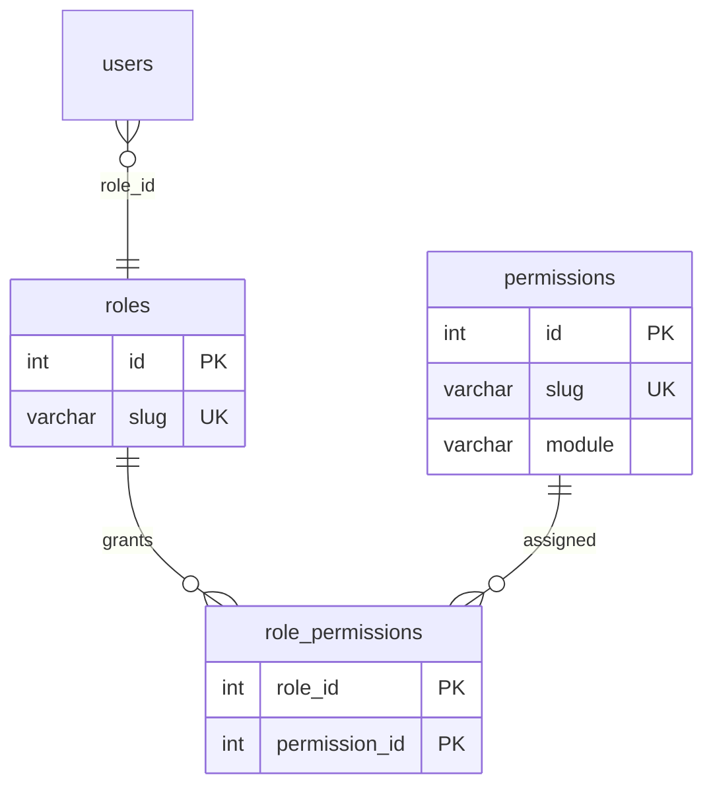

# Phases 12–13 Implementation Report

**Status:** Code complete — run `npm run migrate:payment-rbac` manually  
**Date:** 2026-06-12

---

## Phase 12 — Payment RBAC

### 1. Updated ER diagram



New role slugs: `MERCHANT`, `SUPPORT`, `FINANCE`, `SUPER_ADMIN`  
Existing roles unchanged: `ADMIN`, `MANAGER`, `SALESPERSON`, `DELIVERY`, `DELIVERY_AGENT`, `CUSTOMER`

### 2. Role hierarchy

```
SUPER_ADMIN  → all permissions + admin.override (inherits ADMIN bypass in middleware)
ADMIN        → all payment-platform permissions + existing business perms
FINANCE      → ledger view, settlement execute, reconciliation run
SUPPORT      → payments view all, notifications retry, audit view
MERCHANT     → payments view self, refunds view, settlement view
CUSTOMER     → payments.create, payments.view.self
MANAGER      → unchanged (legacy payments.view = view all)
SALESPERSON  → unchanged
DELIVERY     → unchanged
```

### 3. Permission matrix

| Permission | CUSTOMER | MERCHANT | SUPPORT | FINANCE | ADMIN | SUPER_ADMIN |
|------------|:--------:|:--------:|:-------:|:-------:|:-----:|:-----------:|
| payments.create | ✓ | | | | ✓ | ✓ |
| payments.view.self | ✓ | ✓ | | | ✓ | ✓ |
| payments.view.all | | | ✓ | ✓ | ✓ | ✓ |
| payments.refund.execute | | | | | ✓ | ✓ |
| payments.refund.approve | | | | | ✓ | ✓ |
| ledger.view | | | | ✓ | ✓ | ✓ |
| ledger.reverse | | | | | ✓ | ✓ |
| settlement.view | | ✓ | | ✓ | ✓ | ✓ |
| settlement.execute | | | | ✓ | ✓ | ✓ |
| reconciliation.run | | | | ✓ | ✓ | ✓ |
| webhook.replay | | | | | ✓ | ✓ |
| notifications.retry | | | ✓ | | ✓ | ✓ |
| audit.view | | | ✓ | | ✓ | ✓ |
| admin.override | | | | | | ✓ |

### 4. Endpoint → permission mapping

| Endpoint | Permission(s) |
|----------|---------------|
| POST `/payments/create-order` | `payments.create` |
| POST `/payments/verify` | `payments.create` |
| GET `/payments/:id`, `/payments/status/:id` | `payments.view.self` \| `payments.view.all` |
| GET `/payments/history` | `payments.view.self` \| `payments.view.all` |
| POST `/payments/refund` | `payments.refund.execute` |
| GET `/admin/payments/monitor` | `payments.view.all` |
| GET `/admin/payments/webhooks` | `webhook.view` |
| GET `/admin/payments/ledger/:uuid` | `ledger.view` |
| POST `/admin/payments/reconciliation/run` | `reconciliation.run` |
| POST `/admin/payments/webhooks/:id/replay` | `webhook.replay` |
| POST `/admin/payments/refund/request` | `payments.refund.approve` |
| GET `/ledger/:orderUuid` | `ledger.view` |
| POST `/ledger/reversal` | `ledger.reverse` |
| GET `/settlements/:orderUuid` | `settlement.view` |
| POST `/settlements/execute` | `settlement.execute` (+ `admin.override` if `force`) |
| POST `/webhooks/replay`, `/webhooks/reprocess` | `webhook.replay` |
| GET `/payments/notifications` | `notifications.view` |
| POST `/payments/notifications/retry` | `notifications.retry` |
| GET `/audit/payments` | `audit.view` |
| GET `/audit/webhook-events` | `webhook.view` |
| GET `/audit/ledger-entries/:uuid` | `ledger.view` |

### 5. Migration plan

```
npm run migrate:payment-rbac   # 014-payment-rbac.sql
```

Rollback: `migrations/014-rollback-payment-rbac.sql`

### 6. Files created

- `migrations/014-payment-rbac.sql`
- `migrations/014-rollback-payment-rbac.sql`
- `scripts/run-payment-rbac-migration.js`
- `payments/lib/paymentAccess.js`
- `payments/lib/systemContext.js`
- `payments/middleware/privilegedAudit.js`
- `payments/routes/ledgerRoutes.js`
- `payments/routes/settlementRoutes.js`
- `payments/routes/webhookOpsRoutes.js`
- `payments/routes/notificationOpsRoutes.js`
- `payments/routes/auditOpsRoutes.js`
- `payments/routes/opsRoutes.js`
- `payments/ops/opsMetricsService.js`
- `render.yaml`

### 7. Files modified

- `lib/rbac/requirePermission.js` — `SUPER_ADMIN` bypass, `isPrivilegedRole()`
- `lib/rbac/roleMap.js` — new role slugs
- `lib/rbac/permissionCache.js` — fallback matrix for new roles
- `payments/routes/paymentRoutes.js` — permission guards
- `payments/routes/adminRoutes.js` — per-endpoint permissions (no blanket ADMIN)
- `payments/index.js` — mount new route modules
- `payments/services/paymentService.js` — `paymentAccess` instead of `role === 'admin'`
- `payments/repositories/paymentEventRepository.js` — `requeueDeadLetter()`
- `payments/reconciliation/reconciliationService.js` — SYSTEM audit on CRON
- `scripts/run-*-worker.js` — SYSTEM worker audit
- `package.json` — `migrate:payment-rbac`

---

## Phase 13 — Operations

### Health

- `GET /payments/ops/health` — queue depths, alerts, 503 when dead-letter > 0  
- Render `healthCheckPath` → `/payments/ops/health`

### Dead-letter queue

- `GET /admin/payments/events/dead-letter`
- `POST /admin/payments/events/dead-letter/:id/retry` — requires `reconciliation.run`

### Monitoring & alerting

- `GET /admin/ops/dashboard` — queue metrics
- `GET /payments/ops/alerts` — warn/critical alert list

### Worker scheduling (`render.yaml`)

| Cron | Schedule | Command |
|------|----------|---------|
| payment-events-worker | `*/2 * * * *` | `npm run workers:payment-events` |
| notification-worker | `*/3 * * * *` | `npm run workers:notifications` |
| reconciliation-daily | `0 3 * * *` | `npm run reconcile` |

Workers run as **SYSTEM** identity (audited, no RBAC bypass on HTTP).

### Privileged action audit

Logged via `privilegedAudit` + `audit_logs`:

- refund execution
- settlement execution
- ledger reversal
- webhook replay
- reconciliation run
- dead-letter retry

---

## Test plan

- [ ] Run migration 014
- [ ] CUSTOMER can create/view own payments only
- [ ] FINANCE can run reconciliation, cannot replay webhooks (403)
- [ ] ADMIN retains all existing admin payment routes
- [ ] SUPER_ADMIN can force settlement with `admin.override`
- [ ] `GET /payments/ops/health` returns queue metrics
- [ ] Dead-letter retry requeues event to PENDING
- [ ] Render cron jobs invoke workers successfully
