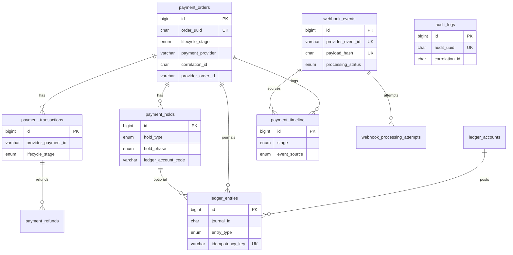
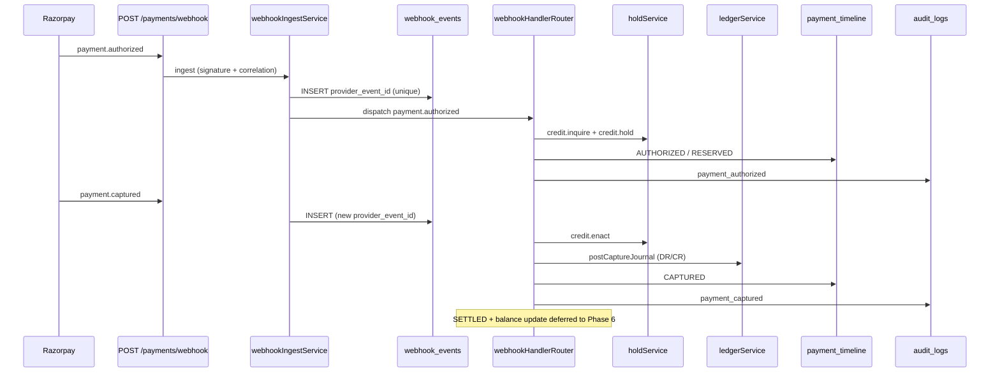

# Phase 1 + 2 + 4 Implementation Report

**Status:** Code complete — **migrations NOT executed** (manual run required)  
**Date:** 2026-06-12

---

## 1. Migrations created

| File | Purpose |
|------|---------|
| [`migrations/012-payment-ledger-platform.sql`](../../migrations/012-payment-ledger-platform.sql) | Forward migration — ledger, holds, webhook_events, timeline, audit_logs, extensions |
| [`migrations/012-rollback-payment-ledger-platform.sql`](../../migrations/012-rollback-payment-ledger-platform.sql) | Manual rollback — drops Phase 1/2/4 tables and columns |
| [`scripts/run-ledger-platform-migration.js`](../../scripts/run-ledger-platform-migration.js) | Runner: `npm run migrate:ledger` |

**Not auto-executed.** Run when ready after review.

---

## 2. ER diagram



---

## 3. New tables (migration 012)

| Table | Phase | Purpose |
|-------|-------|---------|
| `ledger_accounts` | 2 | Chart of accounts (4 seeded accounts) |
| `ledger_entries` | 2 | Double-entry journal lines |
| `payment_holds` | 2 | credit/debit inquire → hold → enact |
| `webhook_events` | 4 | Store-first webhook payloads |
| `webhook_processing_attempts` | 4 | Per-attempt processing log |
| `payment_timeline` | 1 | Full payment journey |
| `audit_logs` | 1 | Unified financial audit trail |
| `payment_events` | — | Schema only (Phase 5 — not wired) |
| `payment_settlements` | — | Schema only (Phase 6 — not wired) |
| `settlement_batches` | — | Schema only (Phase 6 — not wired) |
| `notification_queue` | — | Schema only (Phase 9 — not wired) |
| `notification_attempts` | — | Schema only (Phase 9 — not wired) |
| `payment_notifications` | — | Schema only (Phase 9 — not wired) |
| `reconciliation_summary` | — | Schema only (Phase 10 — not wired) |

### Extended existing tables

- `payment_orders` — `lifecycle_stage`, `payment_provider`, `correlation_id`, `provider_order_id`, timestamps
- `payment_transactions` — `lifecycle_stage`, `provider_payment_id`, `correlation_id`, `settled_at`
- `payment_refunds` — `provider_refund_id`, `lifecycle_stage`, `correlation_id`

---

## 4. Files created

### Repositories (Phase 1)
- `payments/repositories/ledgerRepository.js`
- `payments/repositories/holdRepository.js`
- `payments/repositories/webhookEventRepository.js`
- `payments/repositories/timelineRepository.js`
- `payments/repositories/unifiedAuditRepository.js`

### Ledger core (Phase 2)
- `payments/ledger/journalService.js`
- `payments/ledger/holdService.js`
- `payments/ledger/ledgerService.js`

### Webhook layer (Phase 4)
- `payments/providers/razorpay/RazorpayWebhookParser.js`
- `payments/webhooks/webhookIngestService.js`
- `payments/webhooks/webhookHandlerRouter.js`
- `payments/webhooks/webhookReplayService.js`
- `payments/webhooks/handlerContext.js`
- `payments/webhooks/handlers/authorizedHandler.js`
- `payments/webhooks/handlers/capturedHandler.js`
- `payments/webhooks/handlers/failedHandler.js`
- `payments/webhooks/handlers/orderPaidHandler.js`
- `payments/webhooks/handlers/refundCreatedHandler.js`
- `payments/webhooks/handlers/refundProcessedHandler.js`

### Infrastructure
- `payments/lib/correlation.js`
- `scripts/run-ledger-platform-migration.js`
- `docs/payments/PHASE_1_2_4_IMPLEMENTATION.md` (this file)

---

## 5. Files modified (legacy preserved)

| File | Change |
|------|--------|
| `payments/repositories/paymentRepository.js` | Lifecycle + provider lookup helpers |
| `payments/services/paymentService.js` | `processWebhook` → ingest; legacy renamed `processWebhookLegacy` |
| `payments/index.js` | Correlation IDs; `io` passed to admin routes |
| `payments/routes/adminRoutes.js` | Timeline, ledger, webhook replay endpoints |
| `package.json` | `migrate:ledger` script |

**Not removed:** `webhookReplayGuard.js`, `payment_webhooks` table usage in legacy path, `razorpayService.js`, `auditRepository.js`.

---

## 6. Payment lifecycle sequence (webhook path)



---

## 7. Idempotency protections

| Layer | Key | Never uses |
|-------|-----|------------|
| `webhook_events` | `(payment_provider, provider_event_id)` | `event_type` alone |
| `webhook_events` | `payload_hash` | — |
| `ledger_entries` | `idempotency_key` per line | — |
| `payment_holds` | `idempotency_key` | — |
| Capture handler | Skip if `lifecycle_stage` ≥ CAPTURED | — |
| Failure handler | Skip if CAPTURED/SETTLED/REFUNDED | — |
| Journal | `capture:{payment_id}:DEBIT:PLATFORM_HOLDING` | — |

---

## 8. Rollback plan

1. **Stop traffic** to webhook endpoint (or accept legacy fallback — code auto-falls back if tables missing).
2. Run [`migrations/012-rollback-payment-ledger-platform.sql`](../../migrations/012-rollback-payment-ledger-platform.sql) manually in MySQL.
3. Redeploy previous git commit if needed (new code is backward-compatible via `processWebhookLegacy` fallback).
4. Verify `payment_webhooks` + legacy flow still works.
5. **Data loss on rollback:** all `webhook_events`, `ledger_entries`, `payment_timeline`, `audit_logs` rows are dropped.

---

## 9. Migration execution order

```
1. migrations/002-payments-schema.sql      (if not already applied)
2. migrations/003-security-hardening.sql   (if not already applied)
3. migrations/012-payment-ledger-platform.sql   ← NEW (npm run migrate:ledger)
```

**Command (manual, when approved):**
```bash
npm run migrate:ledger
```

**Do not run** until schema review is complete.

---

## 10. New admin API endpoints

| Method | Path | Purpose |
|--------|------|---------|
| `GET` | `/admin/payments/timeline/:orderUuid` | Payment journey |
| `GET` | `/admin/payments/ledger/:orderUuid` | Ledger entries |
| `POST` | `/admin/payments/webhooks/:id/replay` | Replay stored webhook |
| `GET` | `/admin/payments/webhooks` | Lists `webhook_events` (falls back to `payment_webhooks`) |

---

## 11. Behavioral notes

- **Legacy fallback:** If migration 012 not applied, `processWebhook` catches `ER_NO_SUCH_TABLE` / `ER_BAD_FIELD_ERROR` and runs `processWebhookLegacy`.
- **No Phase 6:** `customers.outstanding_balance` is **not** updated by new webhook handlers (settlement deferred).
- **No Phase 5:** Internal `payment_events` bus table exists but is **not populated** yet.
- **No Phase 9/10:** Notification and reconciliation tables exist in schema only.

---

## 12. Review checklist before merge

- [ ] Review migration SQL on staging MySQL
- [ ] Run `npm run migrate:ledger` on staging
- [ ] Test `payment.captured` webhook → verify `ledger_entries`, `payment_timeline`, `audit_logs`
- [ ] Test duplicate webhook → HTTP 200 `duplicate: true`
- [ ] Test replay endpoint on stored `webhook_events.id`
- [ ] Confirm legacy fallback works without migration on dev
