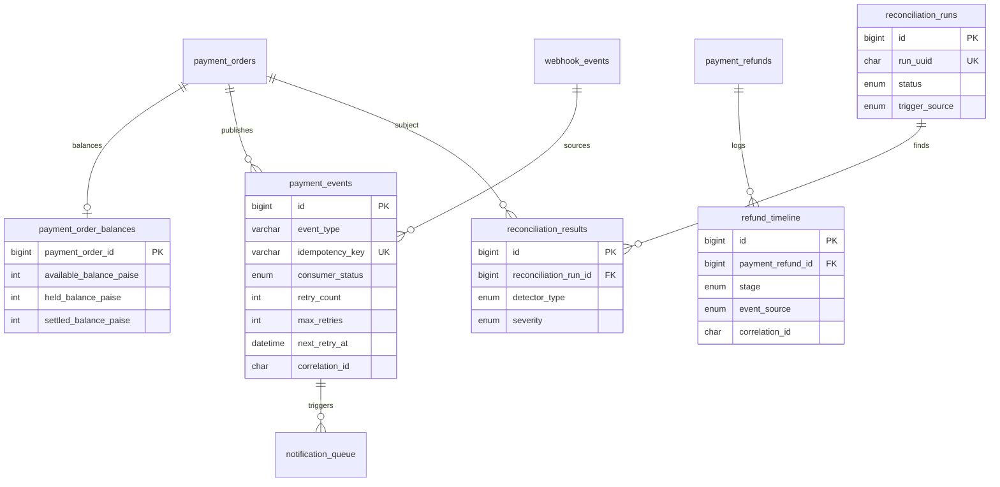
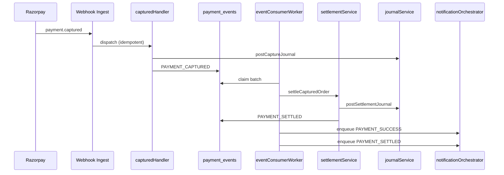
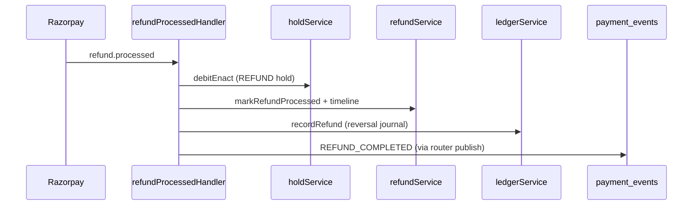

# Phases 5–10 Implementation Report

**Status:** Code complete — **migrations NOT executed** (manual run required)  
**Prerequisite:** Phase 1+2+4 (`012-payment-ledger-platform.sql`) must be applied first  
**Date:** 2026-06-12

---

## 0. Pre-implementation review — flaws identified and mitigations

| Risk | Description | Mitigation applied |
|------|-------------|-------------------|
| Double settlement | Webhook handler + event subscriber both posting settlement journals | Settlement gated on `lifecycle_stage === 'SETTLED'` + `idempotency_key = settle:{orderId}` + journal idempotency keys |
| Double event consumption | Multiple cron workers claim same `payment_events` row | `markProcessing` uses conditional `UPDATE`; worker skips if `affectedRows === 0` |
| Partial journal on crash | Ledger lines posted outside transaction | `journalService.postBalancedJournal` wrapped in `withTransaction`; debits == credits validated before commit |
| Notifications from webhooks | Direct Resend calls in ingest path | Notifications only enqueued from `notificationSubscriber` (event bus), never from `webhookIngestService` |
| Refund over-allocation | Multiple partial refunds exceed capture amount | `refundService.validatePartialRefund` sums existing refunds before accepting new amount |
| Stale capture without settlement | CAPTURED orders never reach SETTLED | `settlementSubscriber` on `PAYMENT_CAPTURED`; reconciliation `MISSING_SETTLEMENT` detector |
| Dead-letter loss | Failed events disappear | `consumer_status = DEAD_LETTER` persisted; admin `GET /payments/events/dead-letter` |
| Subscriber cascade failure | One subscriber failure blocks others | Subscribers run sequentially; settlement failures surface as retry; notification idempotent on re-run |

**Residual risks (operational, not code):**

- Workers must be scheduled on Render (cron or background worker) — events/notifications do not process without `npm run workers:*`.
- `claimPendingBatch` is poll-based, not `SKIP LOCKED` — acceptable for single-worker cron; use one worker instance or rely on optimistic claim.
- Full refund still marks order `REFUNDED` even when partial — partial refunds update transaction only; order stays `SETTLED` until fully refunded (future enhancement).

---

## 1. Implementation plan

### Phase 5 — Internal event bus

1. Extend `payment_events` with retry/dead-letter columns (migration 013).
2. `eventPublisher` — insert domain events after webhook handler dispatch (router only; ingest unchanged).
3. `eventSubscribers` — settlement + notification handlers keyed by event type.
4. `eventConsumerWorker` — poll DB, claim, dispatch, retry with backoff, dead-letter.

### Phase 6 — Internal money movement engine

1. `payment_order_balances` — `available`, `held`, `settled` buckets per order.
2. Extend `holdService` — `credit.inquire/hold/enact`, `debit.inquire/hold/enact`.
3. `balanceService` — move amounts between buckets; initialize on authorize/capture.
4. `settlementService` — `CAPTURED → PROCESSING → SETTLED`, posts settlement journal, updates `customers.outstanding_balance`, publishes `PAYMENT_SETTLED`.

### Phase 8 — Refund completeness

1. `refund_timeline` audit trail per refund.
2. `refundService` — partial validation, created/processed/failed lifecycle.
3. Handlers: `refundCreated`, `refundProcessed`, `refundFailed` — timeline + ledger reversal via `ledgerService.recordRefund`.

### Phase 9 — Resend notification framework

1. Queue-first via existing `notification_queue` / `payment_notifications` / `notification_attempts` (from 012).
2. `notificationOrchestrator` — enqueue from event subscriber only.
3. `notificationWorker` — deliver via Resend (`paymentEmailDelivery.js`), retry tracking.

### Phase 10 — Reconciliation engine

1. `reconciliation_runs` + `reconciliation_results` tables.
2. Five detectors + daily summary upsert.
3. `answerChecklistForOrder` — DB-only answers for capture/settlement/ledger/refund/notification.

---

## 2. Database changes (migration 013)

| Change | Type |
|--------|------|
| `payment_events.consumer_status` | Add `DEAD_LETTER`; add `max_retries`, `next_retry_at` |
| `payment_order_balances` | **New table** |
| `refund_timeline` | **New table** |
| `payment_refunds` | Add `is_partial`, `failed_at`, `failure_reason` |
| `notification_queue.notification_type` | Add `PAYMENT_SETTLED` enum value |
| `reconciliation_runs` | **New table** |
| `reconciliation_results` | **New table** |

**Runner:** `npm run migrate:ledger-phases`  
**Rollback:** `migrations/013-rollback-ledger-phases-5-10.sql`

---

## 3. New tables (013)

```
payment_order_balances
refund_timeline
reconciliation_runs
reconciliation_results
```

Tables from 012 reused (not recreated): `payment_events`, `notification_queue`, `notification_attempts`, `payment_notifications`, `payment_refunds`, `payment_settlements`, `ledger_entries`, `payment_holds`.

---

## 4. ER diagram updates



### Ledger accounts (unchanged codes)

| Code | Role |
|------|------|
| `CUSTOMER_RESERVE` | Customer funds reserved on authorize |
| `PLATFORM_HOLDING` | Platform hold between capture and settlement |
| `MERCHANT_SETTLEMENT` | Merchant settlement after SETTLED |
| `REFUND` | Refund liability / reversal source |

---

## 5. Service architecture updates

```
POST /payments/webhook
  └─ webhookIngestService          [UNCHANGED — store-first, signature, idempotency]
       └─ webhookHandlerRouter
            ├─ authorizedHandler    → credit.inquire/hold + balance init
            ├─ capturedHandler      → credit.enact + capture journal
            ├─ refund*Handler       → debit hold/enact + refund journal
            └─ eventPublisher.publishFromWebhookDispatch  [NEW — Phase 5]

Cron: npm run workers:payment-events
  └─ eventConsumerWorker
       ├─ settlementSubscriber    → settlementService.settleCapturedOrder
       └─ notificationSubscriber  → notificationOrchestrator.enqueue

Cron: npm run workers:notifications
  └─ notificationWorker → Resend (paymentEmailDelivery)

Cron: npm run reconcile
  └─ reconciliationService.runFullReconciliation
```

**Lifecycle:** `PENDING → AUTHORIZED → RESERVED → CAPTURED → PROCESSING → SETTLED`  
Settlement is **async** via event bus (not in webhook ingest path).

---

## 6. Sequence diagrams

### Capture → settle → notify



### Refund processed



---

## 7. New files

| Path | Phase |
|------|-------|
| `migrations/013-ledger-phases-5-10.sql` | 5–10 |
| `migrations/013-rollback-ledger-phases-5-10.sql` | 5–10 |
| `scripts/run-ledger-phases-migration.js` | 5–10 |
| `scripts/run-payment-event-worker.js` | 5 |
| `scripts/run-notification-worker.js` | 9 |
| `scripts/run-reconciliation.js` | 10 |
| `payments/events/eventPublisher.js` | 5 |
| `payments/events/eventSubscribers.js` | 5 |
| `payments/events/eventConsumerWorker.js` | 5 |
| `payments/repositories/paymentEventRepository.js` | 5 |
| `payments/ledger/balanceService.js` | 6 |
| `payments/repositories/balanceRepository.js` | 6 |
| `payments/settlement/settlementService.js` | 6 |
| `payments/repositories/settlementRepository.js` | 6 |
| `payments/refunds/refundService.js` | 8 |
| `payments/repositories/refundTimelineRepository.js` | 8 |
| `payments/webhooks/handlers/refundFailedHandler.js` | 8 |
| `payments/notifications/notificationOrchestrator.js` | 9 |
| `payments/notifications/notificationWorker.js` | 9 |
| `payments/notifications/paymentEmailDelivery.js` | 9 |
| `payments/notifications/templates/index.js` | 9 |
| `payments/repositories/notificationRepository.js` | 9 |
| `payments/reconciliation/reconciliationService.js` | 10 |
| `payments/repositories/reconciliationRepository.js` | 10 |

---

## 8. Modified files

| Path | Change |
|------|--------|
| `package.json` | Scripts: `migrate:ledger-phases`, `workers:payment-events`, `workers:notifications`, `reconcile` |
| `payments/webhooks/webhookHandlerRouter.js` | Publish to event bus after handler (ingest untouched) |
| `payments/webhooks/handlers/authorizedHandler.js` | Balance init + credit hold |
| `payments/webhooks/handlers/capturedHandler.js` | Credit enact + capture journal |
| `payments/webhooks/handlers/refundCreatedHandler.js` | Partial refund validation + timeline |
| `payments/webhooks/handlers/refundProcessedHandler.js` | Delegates to `refundService` |
| `payments/ledger/holdService.js` | Full inquire/hold/enact + balance moves |
| `payments/ledger/journalService.js` | Transactional balanced journal + settlement/refund journals |
| `payments/repositories/paymentRepository.js` | `sumRefundedPaiseForTransaction` |
| `payments/routes/adminRoutes.js` | Reconciliation, dead-letter, checklist endpoints |

**Explicitly NOT modified:** `payments/webhooks/webhookIngestService.js`

---

## 9. Migration order

```
1. npm run migrate:ledger          # 012 — Phase 1+2+4 (if not already applied)
2. npm run migrate:ledger-phases   # 013 — Phase 5–10
```

Verify:

```sql
SHOW TABLES LIKE 'payment_order_balances';
SHOW TABLES LIKE 'reconciliation_runs';
SHOW COLUMNS FROM payment_events LIKE 'next_retry_at';
```

---

## 10. Rollback plan

1. Stop workers: payment-events, notifications, reconcile cron jobs.
2. Run `migrations/013-rollback-ledger-phases-5-10.sql` manually against Railway MySQL.
3. Revert application code to pre–Phase 5 commit if needed.
4. Phase 1+2+4 tables (`012`) remain intact — rollback 013 does not drop ledger core.

**013 rollback drops:** `payment_order_balances`, `refund_timeline`, `reconciliation_runs`, `reconciliation_results`; reverts `payment_events` / `notification_queue` / `payment_refunds` column changes.

---

## Admin API (new)

| Method | Path | Purpose |
|--------|------|---------|
| GET | `/admin/payments/reconciliation` | Recent runs |
| GET | `/admin/payments/reconciliation/:runId` | Run results |
| POST | `/admin/payments/reconciliation/run` | Manual reconciliation |
| GET | `/admin/payments/events/dead-letter` | Failed event bus messages |
| GET | `/admin/payments/checklist/:orderUuid` | Per-order reconciliation checklist |

---

## Operational deployment (Render)

Schedule on Render cron jobs or a background worker:

| Command | Suggested cadence |
|---------|-------------------|
| `npm run workers:payment-events` | Every 1–2 minutes |
| `npm run workers:notifications` | Every 1–2 minutes |
| `npm run reconcile` | Daily (off-peak) |

---

## Test plan

- [ ] Apply 012 then 013 on staging DB
- [ ] Send `payment.authorized` webhook → verify `payment_holds`, `payment_order_balances.held_balance_paise`
- [ ] Send `payment.captured` → verify capture journal; run event worker → `SETTLED`, settlement journal, `outstanding_balance` reduced
- [ ] Verify `PAYMENT_SUCCESS` and `PAYMENT_SETTLED` emails queued (not sent from webhook handler)
- [ ] Partial refund: two `refund.created` + `refund.processed` → `refund_timeline` rows, reversal journals, sum ≤ order amount
- [ ] `refund.failed` → `failed_at`, timeline `FAILED` stage
- [ ] Run `npm run reconcile` → inspect `reconciliation_results`
- [ ] `GET /admin/payments/checklist/:orderUuid` answers all five checklist questions from DB only
